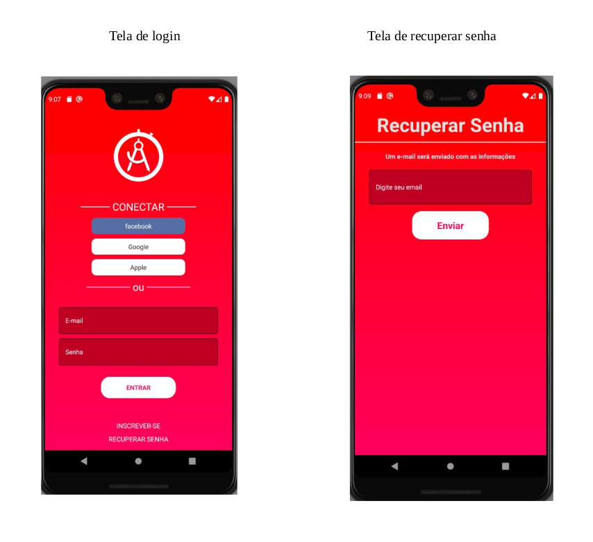
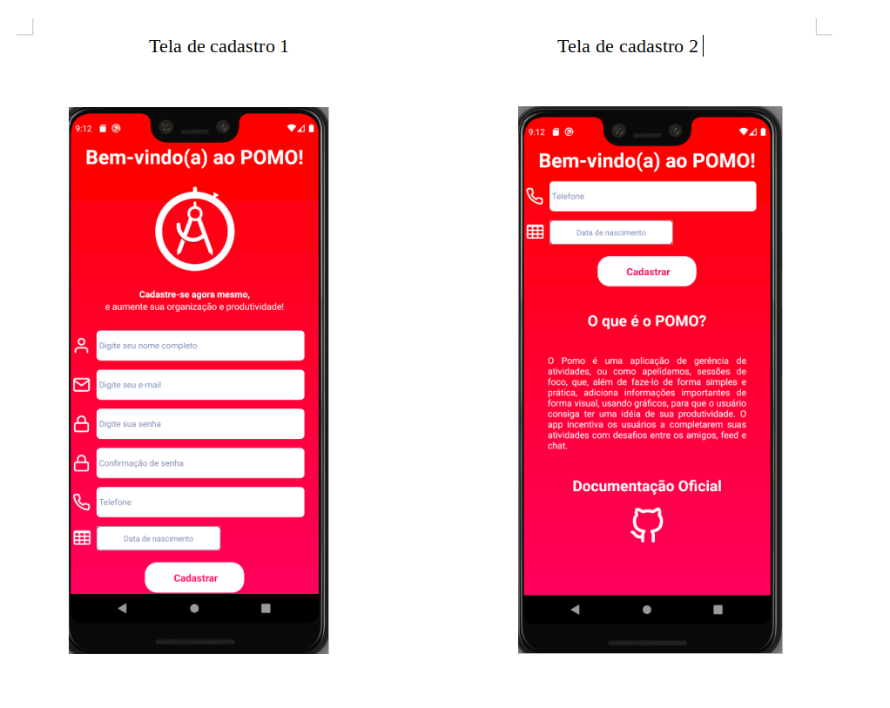
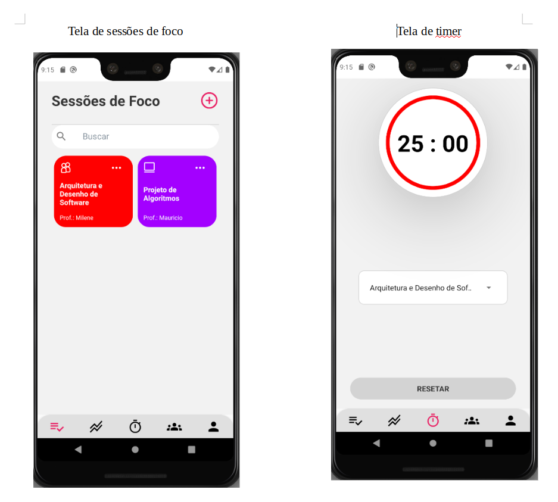

# Pomo

**Número do Grupo**: 06 
**Código da Disciplina**: FGA0208-T01 

## Alunos

| Matrícula  | Aluno                                                                 |
| ---------- | --------------------------------------------------------------------- |
| 16/0111978 | [André Eduardo](https://github.com/Andre-Eduardo "User's github")     |
| 16/0112974 | [Arthur Rodrigues](https://github.com/arthurarp "User's github")      |
| 17/0013651 | [João Gabriel Antunes](https://github.com/flyerjohn "User's github")  |
| 16/0135681 | [Marco Antônio Costa](https://github.com/markinlimac "User's github") |
| 17/0045943 | [Thallys Braz](https://github.com/thallysbraz "User's github")        |

## Sobre

O Pomo é uma aplicação de gerência de atividades, ou como apelidamos, sessões de foco, que, além de faze-lo de forma simples e prática, adiciona informações importantes de forma visual, usando gráficos, para que o usuário consiga ter uma idéia de sua produtividade. 
 

O app incentiva os usuários a completarem suas atividades com desafios entre os amigos, feed e chat.

Repositório para armazenar toda a documentação do projeto Pomo.

[Repositório do frontend](https://github.com/UnBArqDsw/2020.1_G6_Pomo_Frontend) do projeto.

[Repositório da versão iOS nativa](https://github.com/UnBArqDsw/2020.1_G6_Pomo_iOS) do projeto.

[Repositório do Backend](https://github.com/UnBArqDsw/2020.1_G6_Pomo_Backend) do projeto.

## Screenshots

Abaixo as telas de login e recuperar senha seguidas pela tela de cadastro da aplicação.

Abaixo seguem as outras telas:

## Instalação

**Linguagens**: Javascript, Swift 
**Tecnologias**: Node.js, React-Native, Docker, SwiftUI. 
Descreva os pré-requisitos para rodar o seu projeto e os comandos necessários.
Insira um manual ou um script para auxiliar ainda mais.

## Uso

Explique como usar seu projeto caso haja algum passo a passo após o comando de execução.

## Vídeo

### **iOS**

## Outros

Quaisquer outras informações sobre seu projeto podem ser descritas abaixo.
