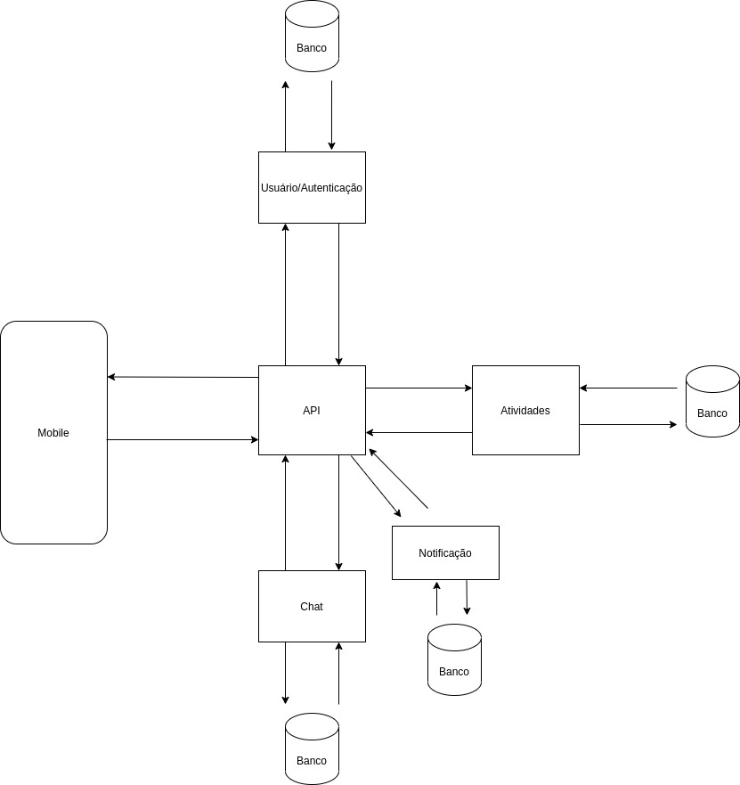
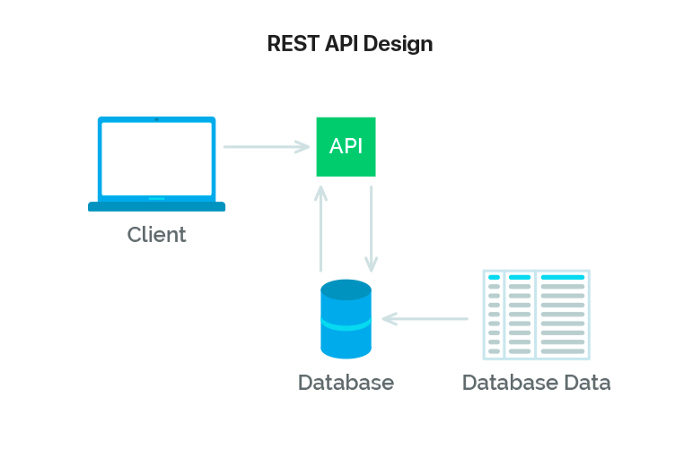
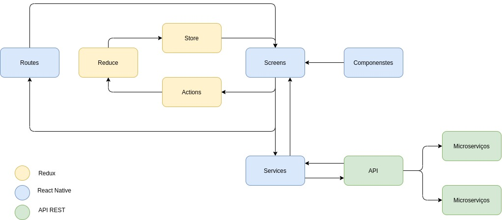
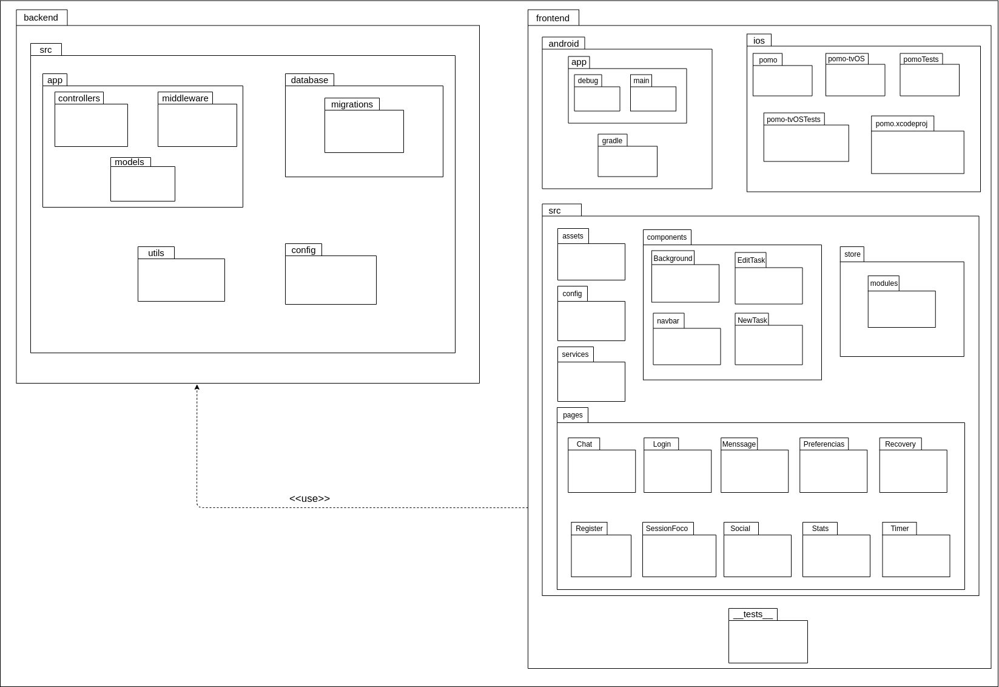
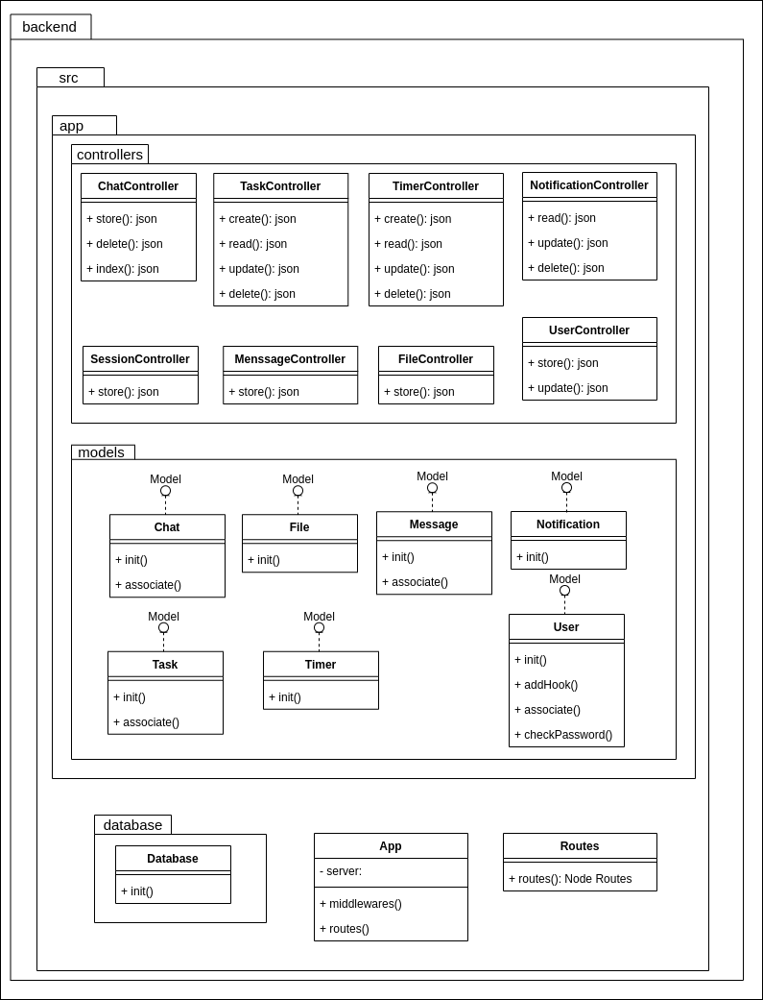
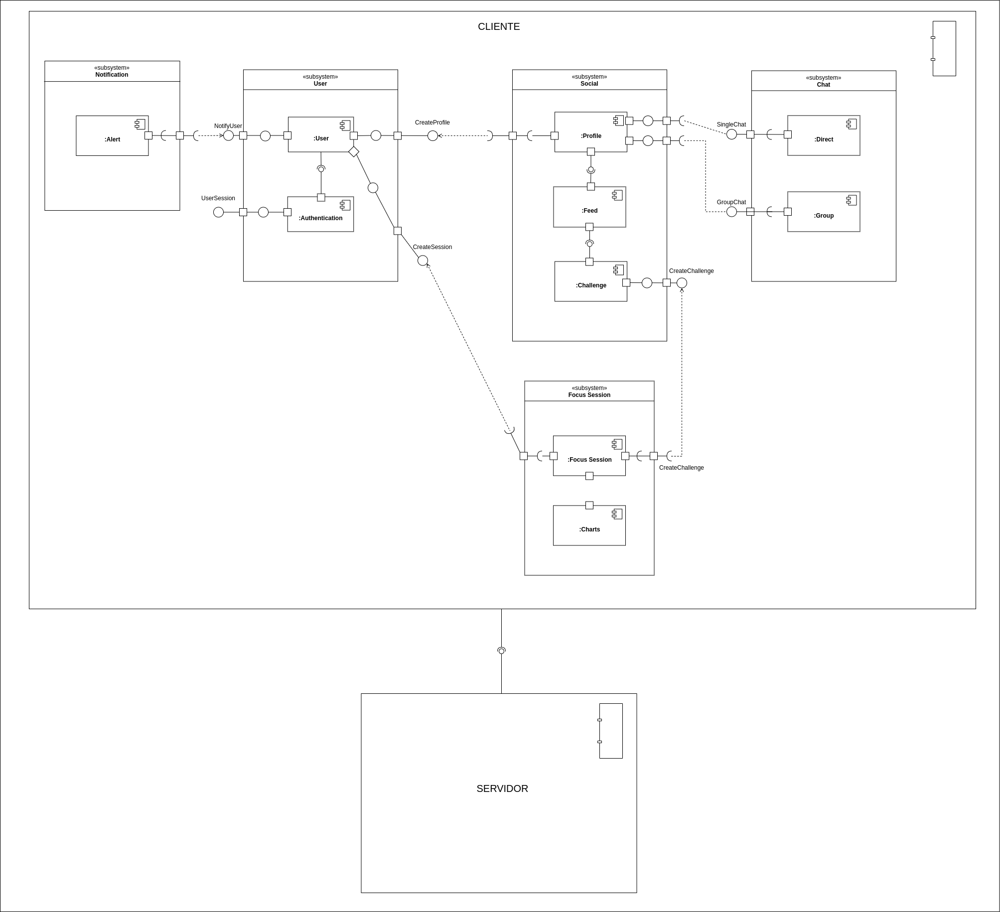

# **Arquitetura POMO**

## Histórico de revisões

|    Data    | Versão |                          Descrição                           |                             Autor                             |
| :--------: | :----: | :----------------------------------------------------------: | :-----------------------------------------------------------: |
| 20/09/2020 |  1.0   |            Criação da página e adição de conteúdo            | [Todos do grupo](https://unbarqdsw.github.io/2020.1_G6_Pomo/) |
| 24/09/2020 |  1.1   |                      Adição de conteúdo                      |       [André Eduardo](https://github.com/Andre-Eduardo)       |
| 16/11/2020 |  1.2   | Adição dos tópicos que estavam faltando (somente o template) |       [Arthur Rodrigues](https://github.com/arthurarp)        |
| 19/11/2020 |  1.3   | Adição dos tópicos que estavam faltando |       [Marco Antônio](https://github.com/markinlimac)        |
| 20/11/2020 |  1.4   | Revisão |       [João Gabriel Antunes](https://github.com/flyerjohn)        |

## 1. Introdução

### 1.1 Finalidade

Este documento de arquitetura tem a função de especificar decisões arquiteturais relevantes no desenvolvimento do App Pomo, Utilizando tecnologias como React Native e Node, descrevendo seus aspectos e funcionalidades dentro sistema de forma clara e objetiva.

### 1.2 Escopo

Neste documento serão retratados os modelos arquiteturais implementados, descrição e utilização de frameworks que compõe a aplicação Pomo.

## 2. Representação da Arquitetura

### 2.1 Diagrama de relações

  O diagrama acima apresenta cada etapa que será seguida para que o Aplicativo Pomo funcione. Relacionando o front-end, Back-end,e as APIs externas.

### 2.2 Componentes

#### Mobile

Componente que representa o front no diagrama que fará as principais requisiçṍes para a API.

#### API

Componente "cérebro" que irá processar os dados advindos dos serviços e, assim, formatar e padronizar essas informações para comunicação com o frontend.

#### Atividades

Componente que irá gerenciar as atividades (CRUD).

#### Usuário/ Autenticação

Componente que irá gerenciar os usuários (CRUD).

#### Chat

Componente que irá gerenciar as conversas.

#### Notificação

Componente que irá gerenciar as notificações.

## 2.3 Padrão de Arquitetura API REST

Trata-se de um conjunto de requisições que permite a comunicação de dados entre aplicações. Para isso, a API REST utiliza requisições HTTP responsáveis pelas operações básicas necessárias para a manipulação dos dados. As principais requisições são: 
POST: criar dados no servidor; 
GET: leitura de dados no host; 
DELETE: excluir as informações; 
PUT: atualizações de registros. 
 

## 2.4 Diagrama React/Redux/Api

### React native

É dividido em pastas, Screens, Routes, Services e Components. A pasta de Screens armazena todas as telas do aplicativo que são formadas utilizando componentes criados na pasta Components, A navegação de telas é feita dentro da Routes. E os Services e responsavel pela comunicação externa da aplicação.

### REDUX

O Redux armazena as informações obtidas no uso do aplicativo em uma store, para facilitar o acesso dessas informações em outras telas. O redux pode ser dividido ainda em arquivos de Actions e Reducers. Um Reducer é um objeto que é salvo na store durante o uso do aplicativo de forma que possa ser chamado e modificado em toda a aplicação. As Actions são responsáveis por requisitar algo para um reducer.

### API Rest

A API Rest, produzida em Node.js, controla e fornece as informações que serão exibidas no aplicativo. Para qualquer acesso aos dados feito pelo aplicativo é necessário que ela seja chamada.
A API é dividida em alguns microserviços, a fim de se obter um maior desacoplamento entre suas funcionalidades.

## 3. Restrições e Metas Arquiteturais

- É necessária a conexão com internet para utilização do App.
- A informação pessoal do usuário será armazenada no banco de dados.
- A aplicação terá suporte para Android e Ios.
- O Front-End será desenvolvido utilizando o framework React-Native, que utiliza a linguagem JavaScript.
- O Back-End será feito em JavaScript, utilizando Node-js.
Serão usadas as plataformas React-Native para o Front-end e NodeJS para o Back-end.
- Os dados do Front-End serão enviados via http request para o Back-End.
- Os dados extraídos do Front-End serão armazenados no banco de dados PostgreSQL.
- Será feita uma arquitetura de microsserviços, para um melhor funcionamento e desempenho do sistema, não possuindo dependências entre si.
- A aplicação deve ser terminada até o final da disciplina de Desenho e Arquitetura de Software.
- Cada ação no Front-End sera salva no banco de dados, pois será necessária para a parte da rede social.

## 4. Visão Lógica

A arquitetura de um software é representada por uma série de visões arquiteturais, as quais, em essência, são fragmentos que ilustram os elementos "significativos em termos de arquitetura" em modelos.

A visão lógica, é a visão que contém as classes de design mais importantes e sua organização em pacotes e subsistemas, e a organização desses pacotes e subsistemas em camadas. Preocupa-se com algumas realizações de caso de uso, as mais significativas. Trata-se de um subconjunto do modelo de design.

### 4.1 Diagrama de Pacotes Geral

Diagramas de pacotes são diagramas estruturais usados para mostrar, em uma forma de pacotes, a organização e disposição de vários elementos de modelos. Um pacote é um agrupamento de elementos UML relacionados, como diagramas, documentos, classes ou até mesmo outros pacotes. Cada elemento é colocado dentro do pacote e é representado como uma pasta de arquivo dentro do diagrama, e depois organizado hierarquicamente no diagrama. Diagramas de pacotes são bastante usados para proporcionar uma organização visual de uma arquitetura em camadas de qualquer classificador UML, por exemplo, um sistema de software.

No Pomo, o diagrama de pacotes geral, representa os pacotes utilizados no backend e no frontend. As ligações entre um pacote e outro foram ignoradas para que não ficasse confuso e de dificil leitura. 

### 4.2 Diagrama de Classes do Back-end API

Diagrama de classes é uma representação da estrutura e relações das classes que servem de modelo para objetos. Podemos afirmar de maneira mais simples que seria um conjunto de objetos com as mesmas características, assim saberemos identificar objetos e agrupá-los, de forma a encontrar suas respectivas classes. Na Unified Modeling Language (UML) em diagrama de classe, uma classe é representada por um retângulo com três divisões, são elas: O nome da classe, seus atributos e por fim os métodos.

No Pomo, o diagrama de classe do backend, representa as classes utilizadas no backend. As ligações entre uma classe e outra foram ignoradas para que não ficasse confuso e de dificil leitura.

Algumas tipagens foram ignoradas por se tratarem de bibliotecas externas que pertecem ao Node-js. A classe Model é um implementação do Node, por isso ela não foi representada no diagrama.

## 7. Visão de Implantação

A visão de Implantação, que contém a descrição dos vários nós físicos da maior parte das configurações comuns de plataforma bem como a alocação das tarefas (da Visão de Processos) nos nós físicos. Essa visão é mais comumente utilizada para sistemas distribuido. Trata-se de um subconjunto do modelo de implantação.

## 8. Visão de Implementação

A Visão de Implementação, que contém uma visão geral do modelo de implementação e sua organização em termos de módulos, organizados em pacotes e camadas. A alocação de pacotes e classes nos pacotes e módulos da Visão de Implementação também é descrita. Trata-se de um subconjunto do modelo de implementação.

## 9. Tamanho e Desempenho

O Aplicativo Pomo possui tamanho em disco de 68MB na plataforma móvel Android, entretanto na plataforma móvel IOS, possui tamanho em disco de 48MB.

A API não tem espaço físico quando é instalado como o aplicativo, a API não é instalada, e representada por um servidor rodando em nuvem, respondendo as requisições, e tal sistema foi construído com foco na otimização da resposta das requisições, por conta dos dados a serem processados, se não houver certo cuidado, pode demorar a responder o aplicativo.

## 10. Qualidade

A arquitetura utilizada contribui para com o software em diversos aspectos. Os padrões arquiteturais das nossas principais frentes do sistema contribuem para a escalabilidade da aplicação, pois contribui altamente para a separação clara de responsabilidades e seus componentes podem ser facilmente substituídos por outros de sua própria implementação.

Os seguintes itens conferem ao sistema aspectos de qualidade, bem como a descrição da abordagem realizada para satisfazer esses aspectos.

| Item       | Solução | Descrição                                      |
|------------|---------|------------------------------------------------|
| Escalabilidade | Arquitetura de Micros serviços | Em prol de permitir que o sistema evolua sem grandes gargalos, o sistema de modularização aplicado pela arquitetura de micros serviços propicia alterações no funcionamento de um serviço sem alterações em grande escala nos demais serviços relacionados, permitindo modificações mais pontuais e uma integração facilitada do sistema.  |
| Confiabilidade | Manutenção Periódica e Modularização do Sistema | Pela modularização do sistema permitir menor impacto de um micros serviço no funcionamento de outro, a prática de manutenções periódicas permite a solução de problemas de forma pontual e sem impedir o funcionamento de demais serviços, ao contrário de abordagens monolíticas  |
| Portabilidade | Arquitetura de Micros serviços | A Utilização da arquitetura de micros serviços permite o desenvolvimento do Backend da aplicação desacoplado do Frontend, permitindo então que esse Frontend seja adaptado para diferentes plataformas, com um funcionamento equivalente conforme o que foi implementado no Backend, contando ainda com a independência de funcionamento de cada serviço.  |

## 11. Referências

>Alifyz, Pires. Consumindo API REST. medium, 2018. Disponível em: <https://medium.com/@alifyzfpires/consumindo-api-rest-com-retrofit-kotlin-no-android-abba52820cc>. Acesso em: 24, setembro de 2021.

>Souza, Ivan. Entenda o que é Rest API . Stage, 2020. Disponível em: <https://rockcontent.com/br/blog/rest-api/>. Acesso em: 24, setembro de 2021.

>Flux:Entendendo a arquitetura com React, GeekHunter, 2019. Disponível em: <https://blog.geekhunter.com.br/flux/>. Acesso em: 24, setembro de 2021.

>Kröger, Helio. Entendendo React e Redux. medium, 2017. Disponível em: <https://medium.com/@hliojnior_34681/entenda-react-e-redux-de-uma-vez-por-todas-c761bc3194ca>. Acesso em: 24, setembro de 2021.

>Tudo sobre diagramas de pacotes UML, lucidchart, 2020. Disponível em: <https://www.lucidchart.com/pages/pt/diagrama-de-pacotes-uml>. Acesso em: 17, novembro de 2021

>Orientações básicas na elaboração de um diagrama de classes, devmedia, 2020 . Disponível em: <https://www.devmedia.com.br/orientacoes-basicas-na-elaboracao-de-um-diagrama-de-classes/37224>. Acesso em: 17, novembro de 2021
