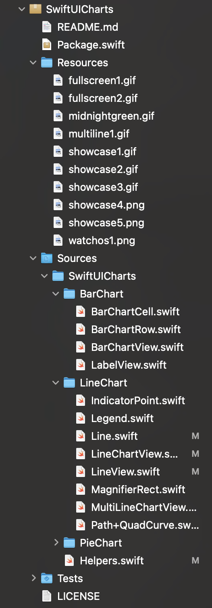
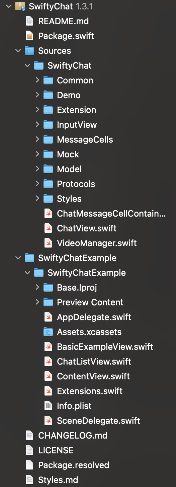
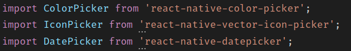
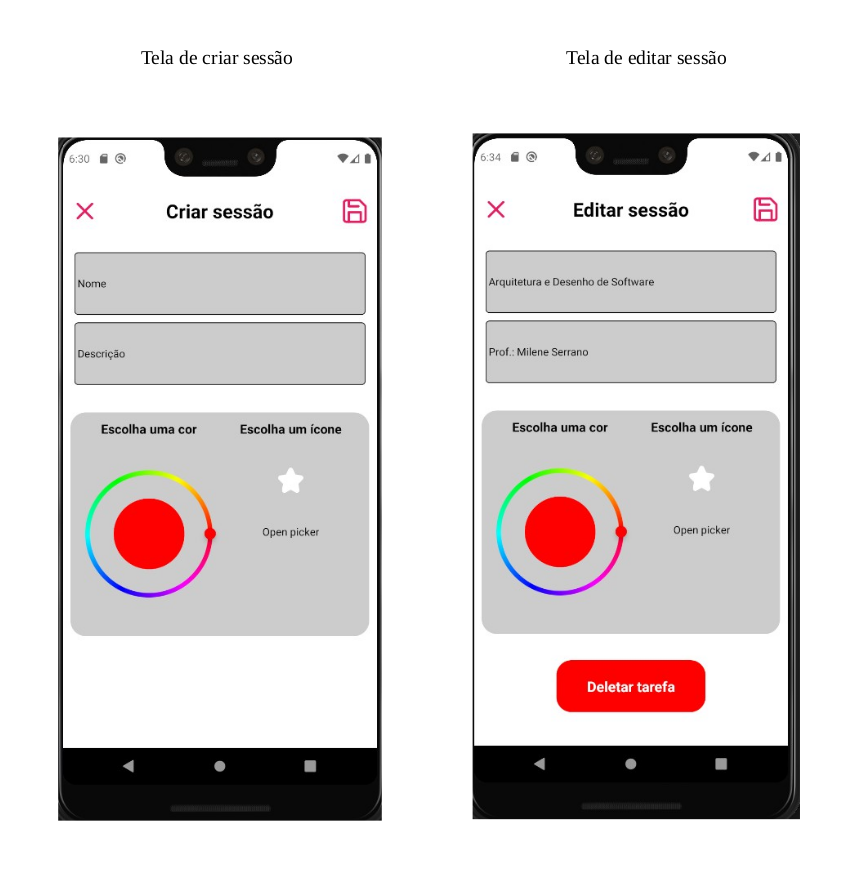
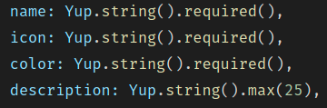

# **Documento de Reutilização de Software**

## **Histórico de revisões**

|    Data    | Versão |                            Descrição                             |                        Autor                         |
| :--------: | :----: | :--------------------------------------------------------------: | :--------------------------------------------------: |
| 16/11/2020 |  1.0   |                 Criação do documento (Template)                  |   [Arthur Rodrigues](https://github.com/arthurarp)   |
| 20/11/2020 |  1.1   |           Adicionando tópico de introdução e objetivos           |   [Arthur Rodrigues](https://github.com/arthurarp)   |
| 20/11/2020 |  1.2   |               Adicionando reutilização no SwiftUI                | [João Gabriel Antunes](https://github.com/flyerjohn) |
| 20/11/2020 |  1.3   | Adicionando reutilização no React Native (Pickers e Componentes) |   [Arthur Rodrigues](https://github.com/arthurarp)   |
| 20/11/2020 |  1.4   |             Adicionando reutilização no Node ( Yup)              |   [Arthur Rodrigues](https://github.com/arthurarp)   |

## 1 **Introdução**

O desenvolvimento de sistemas de informação é tipicamente conhecido como um processo caro e lento. A pressão que acompanha esse processo, bem como a busca constante por redução significativa de custos e alcance de ganhos incomparáveis em qualidade do produto, associados à redução do tempo de desenvolvimento fazem com que o resultado final e a excelência fiquem aquém do desejado. Uma possível solução, que pode não resolver todos os problemas, mas pode ajudar a lidar com esse processo é a reutilização. [[1]](#referencias)

## 2 **Objetivos**

A reutilização de software se baseia no uso de conceitos, produtos ou soluções previamente elaboradas ou adquiridas para criação de um novo software, visando melhorar significativamente a qualidade e a produtividade. [[1]](#referencias)

## 3 **Reutilização de Código no Pomo**

### 3.1 Projeto em SwiftUI

O projeto em SwiftUI, utilizando o padrão MVVM, reutilizou dois grandes pacotes, os SPM (Swift Package Manager). 
O primeiro, o SwiftUICharts, foi utilizado para estilizar os componentes estatísticos, da página Stats (Estatísticas). Porém, nosso time precisou adaptar grande parte do código para atender as necessidades da aplicação em si. A imagem abaixo demonstra a estrutura básica de um SPM, aproveitando esse primeiro exemplo.

O segundo pacote utilizado foi o SwiftyChat, que agiliza a implementação de um chat básico, disponibilizando a capacidade de adaptarmos a UI e a comunicação com o backend conforme o necessário pro nosso projeto. A imagem abaixo demonstra as dependências desse pacote de Swift.

### 3.2 **Projeto em React Native**

Um dos motivos por termos escolhido este framework, em javascript, para a realização da versão android foi a grande capacidade que ele tem de reutilização de código. Para o projeto foram utilizadas vários pacotes que já continham vários componentes prontos onde a equipe só os adaptavam para o Pomo. Exemplos:

#### Pickers

Que foram de grande ajuda, pois implementar do zero iria demandar um bom tempo.

#### Componentes

Ao rodar a aplicação é possível perceber que as páginas de criar tarefa e editar tarefa são bem parecidas:

E não é por acaso. Utilizamos praticamente o mesmo código para as duas telas, obviamente com algumas adaptações como o título e o botão de deletar, além dos endereços, em que cada tela busca na api, serem diferentes.

### 3.2 **Projeto em NodeJS**

Tivemos aumento na produtividade em utilizar este framework, pois com poucas linhas de código foi possível construir uma api rest com o node. Foram utilizadas bibliotecas que nos auxiliaram a fazer a verificação dos dados como, por exemplo:

#### Yup

no campo nome, na imagem acima, se o usuário enviar algo diferente de uma string, automaticamente o Yup reconhece que não veio o tipo certo e retorna um erro. Isso certamente nos poupou algum trabalho.

## **Pontos Candidatos à Reutilização**

### **Ponto 1**

### **Justificativa**

## **Referências**

> 1. Reutilização de Software - Revista Engenharia de Software Magazine 39. Devmedia, 2011. Disponível em: <https://www.devmedia.com.br/reutilizacao-de-software-revista-engenharia-de-software-magazine-39/21956>. Acesso em: 20/11/2020.
