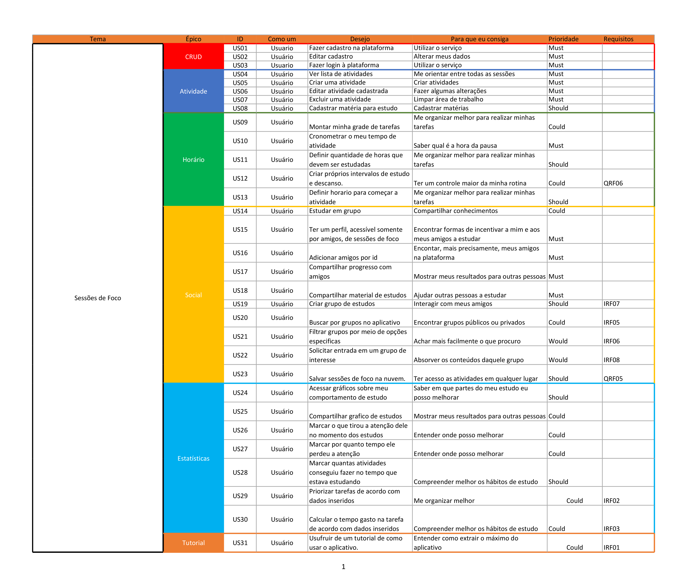
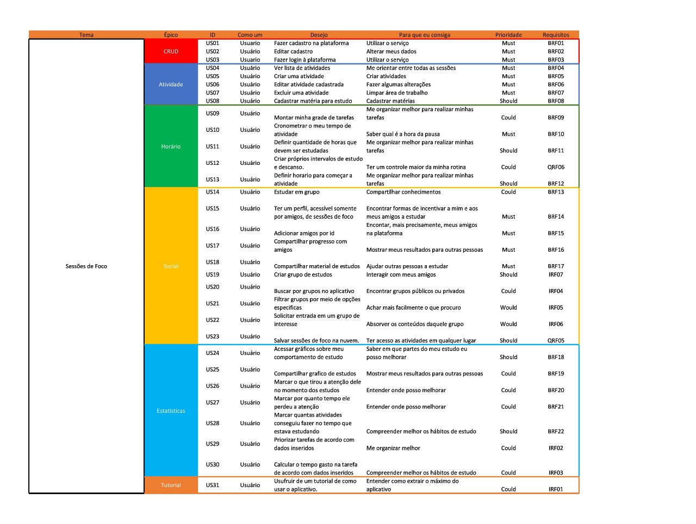

# Backlog

## **Histórico de versões**
|Data|Versão|Descrição|Autor|
|:---|:---|:---|:---|
|10/09/2020|1.0|Criação do artefato |Time|
|10/09/2020|1.0|Adição do artefato |[João Gabriel Antunes](https://github.com/flyerjohn)|
|11/09/2020|1.1|Edição do conteúdo |[Marco Antônio](https://github.com/markinlimac)|

## **Introdução**

&emsp;&emsp;Em termos gerais, o Product BackLog é uma listagem de todos os afazeres pendentes no projeto. Ele substitui o modelo tradicional de especificação de artefatos. Cada elemento da listagem é elicitado por meio de interação da equipe de desenvolvimento com o Cliente - podendo ser apenas um representante, o que torna os elementos levantados muito arbitrários; ou podendo ser uma equipe representante do Cliente, representando as diversas áreas que utilizarão o produto.

## **Backlog**
Versão 1

Versao 2 [(Link Doc)](https://drive.google.com/file/d/1pXQ-phR0HyA2awmY7znqL-aSYU043iaS/view?usp=sharing)

## **Referências**
1. 1. [Zowghi, D.; Coulin, C._Requirements Elicitation: A Survey of Techniques, Aproaches and Tools_.](https://web.eecs.umich.edu/~weimerw/2018-481/readings/requirements.pdf) Acesso em: 08/09/2020.