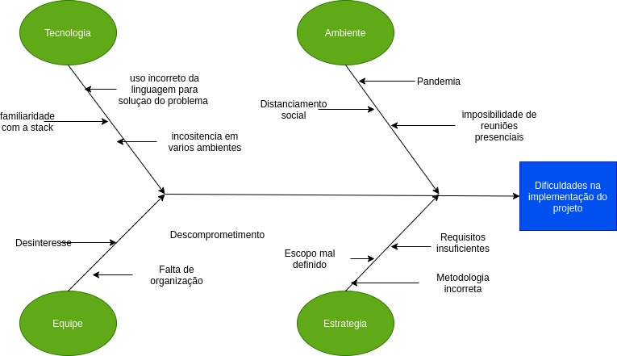
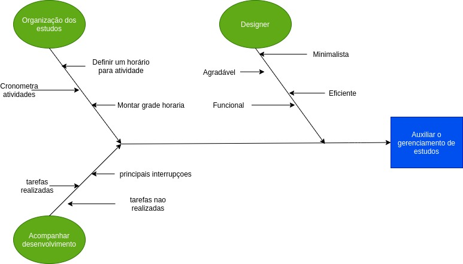

# Causa e Efeito

## Histórico de revisões

| Data       | Versão | Descrição                              | Autor                                            |
| :--------- | :----- | :------------------------------------- | :----------------------------------------------- |
| 08/09/2020 | 1.0    | Criação da página e adição de conteúdo | [Andé Eduardo](https://github.com/Andre-Eduardo) |

## Sumário

1. [Introdução](#1-introdução)
2. [Objetivo](#2-objetivo)
3. [Diagramas de causa e feito desenvolvidos pela equipe](#3-diagramas-de-causa-e-feito-desenvolvidos-pela-equipe)
4. [Referências](#4-referências)

### 1. Introdução

O Diagrama de Causa e Efeito, é uma ferramenta da qualidade que ajuda a levantar as causas-raízes de um problema, analisando todos os fatores que envolvem a execução do processo.

### 2. Objetivo

O diagrama busca considerar todos os aspectos que podem ter levado à ocorrência do problema, dessa forma, ao utilizá-lo, as chances de que algum detalhe seja esquecido diminuem consideravelmente.

### 3. Diagramas de causa e feito desenvolvidos pela equipe.

 
Autor: André Eduardo 
 
Autor: André Eduardo 

### 4. Referências

PEINADO, Jurandir; GRAEML, Alexandre Reis. Administração da produção: operações industriais e de serviços. Curitiba: UnicenP, 2007.
