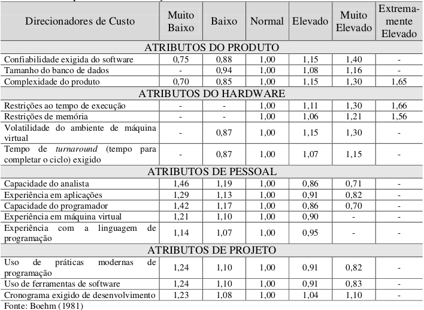

# **Estimativas**

## Histórico de revisões

|Data|Versão|Descrição|Autor|
|:---:|:---:|:---:|:---:|
|09/09/2020|1.0|Criação da página e adição de conteúdo |[Arthur Rodrigues](https://github.com/arthurarp)|
|09/09/2020|1.1|Adição de modelos de estimativa, escolha do modelo e visão geral sobre o COCOMO |[Arthur Rodrigues](https://github.com/arthurarp)|
|10/09/2020|1.2|Aplicação dos métodos de estimativa |[Arthur Rodrigues](https://github.com/arthurarp)|
|11/09/2020|1.3|Edição do conteúdo |[Arthur Rodrigues](https://github.com/arthurarp)|

## **Sumário**

1. [Introdução](#1-introdução)
2. [Objetivo](#2-objetivo)
3. [Modelos de estimativa](#3-modelos-de-estimativa)
4. [Escolha do modelo](#4-escolha-do-modelo)
5. [COCOMO](#5-cocomo)
6. [Aplicação](#6-aplicacao)
7. [Resultados](#7-resultados)
8. [Referências](#8-referencias)

## 1. **Introdução**

De acordo com Antônio Mendes da Silva Filho, professor e consultor em tecnologia da informação e comunicação, a definição para estimativa de custo de software é: "O processo de prever a quantidade de esforço e tempo necessários para desenvolver esse artefato ou produto."  [[2]](#8-referencias)

Uma outra abordagem é a da pesquisadora Maristela Meller que diz em seu trabalho: "O custo de fabricação é o valor dos insumos efetivamente utilizados na fabricação de um determinado produto, ou seja, o valor dos materiais, máquinas e equipamentos, custos gerais de fabricação (por exemplo, energia elétrica, água e depreciação), mão-de-obra produtiva e mão-de-obra de gerência e supervisão, serviços de apoio à produção (por exemplo, manutenção, almoxarifado, refeitório), entre outros, realmente envolvidos no processo de fabricação do produto em questão." [[3]](#8-referencias)

Segundo Fenton e Pfleeger (1997): "Uma estimativa é uma avaliação de probabilidade. Uma estimativa só é útil se for razoavelmente precisa. Não se espera que uma estimativa seja exata, mas que seja precisa o suficiente para que se tenha segurança de fazer julgamentos e tomar decisões, considerando os limites do intervalo de confiança."  [[3]](#8-referencias)

Com essas três visões diferentes e muito esclarecedoras, é possível ter uma boa noção da importância deste artefato para a gestão de um projeto, financeiramente falando. Um modelo que tenha estimativas precisas e que contenha uma boa quantidade de informações sendo levadas em conta, muito provavelmente terá um resultado bom no final.

## 2. **Objetivo**

Estimativas são necessárias nas fases iniciais do ciclo de vida de cada projeto, pois há uma necessidade de apresentar propostas apropriadas de negócio e administrar corretamente os recursos ao longo do mesmo. O uso de técnicas formais de estimativa pode dobrar a probabilidade do projeto de software ser concluído com sucesso, conforme indicaram as pesquisas de Roetzheim (2000b). [[4]](#8-referencias)

Por falar em recursos, esses são itens realmente complicados de lidar, pois a habilidade intelectual dos membros pode variar bastante, já que depende de uma análise das competências de cada indivíduo. Os recursos financeiros e físicos podem ser suficiente para alguns projetos e insuficientes para outros além do prazo que varia bastante de cliente para cliente e de projeto para projeto. [[1]](#8-referencias) E um dos objetivos deste artefato é mensurar, em forma de valor, essas incertezas advindas do processo de desenvolvimento de software.

## 3. **Modelos de estimativa**
Abaixo uma pequena tabela, um resumo, com os principais benefícios e limitações de alguns modelos de estimativa de projeto de software.

|**Modelo**|**Métricas**|
**Benefícios**|
**Limitações**|
|:----:|:---:|:-------|:-------|
|**Opinião de especialistas**|  Independente | - Método rápido;  - Custo relativamente baixo;  - Se o especialista possuir experiência em projetos similares, as estimativas podem ser bastante precisas.| - Depende muito do conhecimento do especialista;  - Difícil de documentar os aspectos considerados na estimativa.|
|**COCOMO**| Orientada ao tamanho | - Abrange vários escopos de projeto (pequenos, médios e grandes);  - Mais formal e preciso;   - Considera o conhecimento da equipe de desenvolvimento;   - Os direcionadores de custos são úteis para o estimador entender o impacto de diferentes fatores que afetam os custos do projeto. | - As entradas são consideradas subjetivas ;  - Dificuldade na  quantificação de certos fatores |
|**Pontos de função**| Orientada à função | - Independe da linguagem de programação;   - Independe do tamanho do projeto. | - Método se tornando obsoleto, devido ao fato dos frameworks gerarem muitas linhas de código, o que não exige tanto tempo do programador;   - O modelo não considera a reutilização de código.   |
|**Price-to-win**| Independente | - Conquista de contrato;  - Bom para empresas de cunho mais agressivo de disputa de mercado.  | - Os custos, normalmente, não refletem o esforço exigido;   - As chances de que o cliente venha a receber o produto são menores.|

## 4. **Escolha do modelo**

Nesta primeira versão, não conseguimos aprofundar nos vários modelos existentes. Mas com base na tabela acima, na experiências dos colegas que já fizeram a disciplina e no exemplo de um bom artefato de estimativa de custos sugerido pela professora, Milene Serrano, em que as expectativas foram atentidas; levando em conta esses aspectos, **o método COCOMO pareceu ser uma boa e atraente escolha como técnica de estimativa de projeto de software para o POMO**.

## 5. **COCOMO**

COCOMO (Constructive Cost Model) ou Modelo de Custo Construtivo, é um modelo de estimativa do tempo de desenvolvimento de um software. Criado por Barry Boehm. É baseado no estudo de sessenta e três projetos. Os programas examinaram de 2.000 a 100.000 linhas de código em linguagens de programação de Assembly a PL/I. Pelo fato dessa metodologia ter utilizado várias linguagens de programação para criar as deduções, constantes e atributos para cada situação, esse método pode ser considerado generalista e útil para quase todos os projetos de software. O COCOMO pode ser divido em três implementações, a depender do tipo de software que será desenvolvido e qual o grau de confiabilidade se quer chegar na estimativa de um projeto, são eles:

- **COCOMO Básico (Basic):** computa o esforço e o custo de desenvolvimento considerando uma estimativa do tamanho do programa (em LOC ou contagem do número de linhas de código).
- **COCOMO Intermediário (Intermediate):** computa o esforço e o custo de desenvolvimento considerando uma estimativa do tamanho do programa e um conjunto de direcionadores de custo (avaliações subjetivas do produto, do hardware, do pessoal e dos atributos do projeto).
- **COCOMO Detalhado (Detailed):** além das características do COCOMO intermediário, inclui uma avaliação do impacto dos direcionadores de custo sobre cada etapa do desenvolvimento.

**O modelo COCOMO pode ser aplicado em três classes de projetos:**

- **Modo Orgânico:** Projetos simples, relativamente pequenos, com conjuntos de requisitos não tão rígidos, com equipes pequenas e experientes.
- **Modo Semidestacado:** Projetos intermediários (em tamanho e complexidade), com alguns requisitos rígidos e outros não tão rígidos, com níveis mistos de experiência nas equipes.
- **Modo Embutido:** Projetos com conjunto rígido de restrições operacionais, tanto de hardware, quanto de software. [[4]](#8-referencias)

## 6. **Aplicação**

**Para o projeto POMO, foi decidido que é mais viável aplicar o COCOMO Intermediário**, pois é necessário um bom grau de confiabilidade nas estimativas. A abordagem básica não considera nenhuma particularidade do projeto, nem do pessoal de desenvolvimento, e essas particularidades devem ser consideradas. A abordagem detalhada (avançada), que tem o mais alto grau de confiabilidade, foi vista como inviável devido ao fato de que seria necessária a geração de uma nova estimativa em cada passo do desenvolvimento.

Também foi definido que **o COCOMO será aplicado no Modo Semidestacado**, que representa um estágio intermediário entre os modos orgânico e embutido.

### **COCOMO Intermediário**

Neste modelo, o COCOMO Básico é ampliado com a finalidade de levar em consideração um conjunto de atributos direcionadores do custo que são agrupados em quatro categorias:

|**Atributos do produto**|**Atributos do hardware**|**Atributos de pessoal**|**Atributos de projeto**|
|:--:|:--:|:--:|:--:|
|Confiabilidade exigida do software;|Restrições ao tempo de execução;|Capacidade do analista;| Uso de práticas modernas de programação;|
|Tamanho do banco de dados;|Restrições de memória;|Experiência em aplicações; | Uso de ferramentas de software;|
|Complexidade do produto.|Volatilidade do ambiente de máquina virtual;| Capacidade do programador;| Cronograma exigido de desenvolvimento. | 
|XXX|Tempo de turnaround (tempo para completar o ciclo) exigido.| Experiência em máquina virtual;|XXX|
|XXX|XXX| Experiência com a linguagem de programação.|XXX |

Cada um desses atributos deve ser classificado de acordo com uma escala que varia de “muito baixo” a “extremamente elevado” (em importância e valor). Esta escala é apresentada na tabela abaixo (publicada por Boehm, 1981). A partir desta classificação determina-se o Multiplicador de Esforço. O produto de todos os resultados de Multiplicadores de Esforços é chamado de Fator de Ajustamento de Esforço (PRESSMAN, 1995).  

### **Tabela de Multiplicadores de esforços**

### **Importância das Estimativas de Esforço**

Com certeza, o tamanho do esforço de desenvolvimento afetará significativamente o custo do projeto. Além disso, provavelmente a intuição conte como um fator adicional, além da experiência e da capacidade da equipe de desenvolvimento, que também tem um grande impacto (ROETZHEIM, 2000b).

### **Importância das Estimativas de Tempo**

Peters (2000) afirma que o menor tempo possível pode não ser realizável por boa parte das organizações. Para alcançar o menor tempo possível, a equipe de projeto precisa ser altamente qualificada e experiente, o processo de desenvolvimento deve ter sido muito bem definido e amadurecido, e o projeto tem que estar perfeito. Não há muitas organizações que podem fazer o menor tempo possível, assim é mais conveniente não esperar por isto. O melhor a fazer é determinar o menor tempo realizável pela organização (geralmente o tempo normal). 

Como a equipe tem o deadline definido (4 meses), pode acontecer de não ser entregue o produto em sua forma completa. Mas de acordo com Roetzheim (2000b), existem quatro estratégias básicas que podem ser consideradas: reduzir a funcionalidade, dividir as tarefas, usar desenvolvimento paralelo redundante e aumentar a reutilização. Reduzir a funcionalidade é a melhor delas.

### **Importância das Estimativas de Tamanho**

Segundo Trindade (2000), a utilização de LOC-Linhas de Código é a primeira e mais natural das formas de medir o tamanho de um sistema computacional. Park (1992) afirma que essa medida tem aplicação direta no planejamento e estimativa de projetos de software, pois pode ser usada no cálculo da produtividade, na normalização de indicadores de qualidade e ainda na derivação de medidas de utilização de memória

### **Cálculo das estimativas de Esforço e Tempo**

Como **o COCOMO Intermediário é uma ampliação do modelo básico**, para o cálculo de tempo de desenvolvimento vamos utilizar a equação básica presente no modelo COCOMO Básico:

    T = c x E^d

O modelo COCOMO Intermediário utiliza a seguinte equação para a estimativa de esforço:

    E = a x S^b x FAE

Onde:

- **T**: é o tempo de desenvolvimento (em meses cronológicos).
- **E**: é o esforço aplicado (em pessoas-mês);
- **S**: é o número (estimado) de linhas de código para o projeto (em milhares);
- **a**: é um coeficiente fornecido pela [**tabela abaixo**](#tabela-de-expoentes-e-coeficientes-para-o-modo-semidestacado);
- **b**: é um expoente fornecido pela [**tabela abaixo**](#tabela-de-expoentes-e-coeficientes-para-o-modo-semidestacado);
- **c**: é um coeficiente fornecido pela [**tabela abaixo**](#tabela-de-expoentes-e-coeficientes-para-o-modo-semidestacado);
- **d**: é um expoente fornecido pela [**tabela abaixo**](#tabela-de-expoentes-e-coeficientes-para-o-modo-semidestacado);
- **FAE**: é o Fator de Ajustamento do Esforço (multiplicação de cada um dos Multiplicadores de Esforço fornecidos pela [**Tabela de Multiplicação de Esforços**](#tabela-de-multiplicadores-de-esforcos)).
 
 

Para Boehm (1981) os **valores do coeficiente "a" e do expoente "b" do modelo COCOMO Intermediário** e os **valores do coeficiente "c" e do expoente "d" vindos do modelo COCOMO Básico** são apresentados abaixo:

### **Tabela de Boehm**

Como estamos utilizando o COCOMO Intermediário no modo Semidestacado, essa tabela foi montada para facilitar os valores que serão utilizados nessa abordagem.

Nesta tabela estão separados somente os valores úteis, ou seja, que estamos usando para fazer o cálculo das estimativas do nosso projeto. 

|**Projeto de Software**|**a**|**b**|**c**|**d**|
|:--:|:--:|:--:|:--:|:--:|
|Semidestacado|3,00|1,12|2,50|0,35|

 

### **Tabela para cálculo do FAE**

Calcula-se o FAE classificando ([entre muito baixo e extremamente elevado](#tabela-de-multiplicadores-de-esforcos)) cada um dos direcionadores de custo de acordo com as necessidades do projeto em questão. Para obter o resultado basta multiplicar todos os valores.

A tabela abaixo foi adaptada dessa tabela [aqui](#tabela-de-multiplicadores-de-esforcos). Temos abaixo só os valores que foram decididos pela equipe para cada direcionador de custo, facilitando o cálculo do FAE, onde só é preciso multiplicar todos os atributos da ultima coluna.

|**Direcionadores de Custo**|**Atributos**|**Classificação**|**Valor do atributo**|
|:--:|:--:|:--:|:--:|
|Confiabilidade exigida do software|Do produto|Elevado|1,15||
|Tamanho do banco de dados|Do produto|Normal|1,00|
|Complexidade do produto|Do produto|Normal|1,00|
|Restrições ao tempo de execução|Do hardware|Normal|1,00|
|Restrições de memória|Do hardware|Normal|1,00|
|Volatilidade do ambiente de máquina|Do hardware|Normal|1,00|
|Tempo de turnaround (tempo para completar o ciclo) exigido|Do hardware|Normal|1,00|
|Capacidade do analista|De pessoal|Normal|1,00|
|Experiência em aplicações|De pessoal|Elevado|0,91|
|Capacidade do programador|De pessoal|Normal|1,00|
|Experiência em Máquina Virtual|De pessoal|Muito Baixo|1,21|
|Experiência com a linguagem de programação|De pessoal|Elevado|0,95|
|Uso de práticas modernas de programação|De projeto|Muito Elevado|0,82|
|Uso de ferramentas de software|De projeto|Elevado|0,91|
|Cronograma exigido de desenvolvimento|De projeto|Normal|1,00|
|**Valor do FAE**|**0,89**|

### **Linhas de Código**

Para o desenvolvimento da aplicação será feita a utilização de frameworks baseados em JavaScript como Node e React Native, que causam uma redução em termos de esforço, tempo e linhas de código. Após a equipe de desenvolvimento se reunir foi gerada, abaixo, uma estimativa de quantas linhas de código serão utilizadas divididas por serviços:

**BACKEND**

- Crud de login: 200 linhas
- Crud de tarefas: 400 linhas

**FRONTEND** 

- Tela de cadastro: 100 linhas
- Tela de login: 200 linhas
- Tela de recuperar senha: 50 linhas
- Tela de sessões de foco: 300 linhas
- Tela de adicionar tarefa: 100 linhas
- Tela de excluir tarefa: 50 linhas
- Tela de editar tarefa: 100 linhas
- Tela de ver tarefa: 100 linhas
- Tela de gráficos de desempenho: 200 linhas
- Tela de timer: 200 linhas
- Tela de adicionar amigo: 100 linhas
- Tela para compartilhar material: 150 linhas
- Tela para interação com amigos: 200 linhas
- Tela para ver pedidos de amizade: 50 linhas

||**BackEnd**|**FrontEnd**|**Total (linhas de código)**|
|:--:|:--:|:--:|:--:|
|Linhas| 600| 1900| **2500 (2,5Kloc)**|

Como foi visto [aqui](#importancia-das-estimativas-de-tempo), boa parte das organizações não conseguem entregar o produto final no prazo, o que teria como uma das soluções a diminuição do escopo. Diminuindo o escopo em 20% passaremos de 2,5Kloc para **2Kloc**. 

Levando esse risco em consideração, será feito um calculo para cada valor de Kloc (2;2,5).

## 7. **Resultados**

### **Estimativa de esforço**

Relembrando a fórmula:

[E = a x S^b x FAE](#calculo-das-estimativas-de-esforco-e-tempo)

Para a abordagem inicial **(2,5Kloc)**

    a = 3,00
    b = 1,12
    S = 2,5 Kloc
    FAE = 0,89

Temos:

    E = 3,00 x (2,5)^1,12 * 0,89

    E = 6,78 pessoas/mês

    Esforço ≈ 7 pessoas/mês

Para a segunda abordagem **(2Kloc)**

    a = 3,00
    b = 1,12
    S = 2 Kloc
    FAE = 0,89

Temos:

    E = 3,00 x (2)^1,12 * 0,89

    E = 5,8 pessoas/mês

    Esforço ≈ 6 pessoas/mês

### **Estimativa de tempo**

Relembrando a fórmula: 
[T = c x E^d](#calculo-das-estimativas-de-esforco-e-tempo)

Para a abordagem inicial **(2,5Kloc)**

    c = 2,50;
    E = 7 (pessoas/mês)
    d = 0,35

Temos:

    T = 2,50 x 7^0,35

    Tempo = 4,93 meses

    

Para a segunda abordagem **(2Kloc)**

    c = 2,50;
    E = 6 (pessoas/mês)
    d = 0,35

Temos:

    T = 2,50 x 6^0,35

    Tempo = 4,68 meses

### **Estimativa de custos**

Com os resultados obtidos das estimativas de esforço e tempo, percebemos que essas informações se assemelham ao que temos como realidade no projeto e nos deixam mais confiantes para finalizá-lo. Como o grupo tem 5 integrantes e temos 4 meses para entregar o trabalho, decidimos usar essas medidas reais, que por sinal estão bem próximas das medidas estimadas.

**Pessoal**

De acordo com o site Glassdoor [[6]](#8-referencias) um desenvolvedor JavaScript ganha em média R$3019 / mês.

|**Cargo**|**Quantidade**|**Valor**|**Tempo (meses)**| **Total**
|:--:|:--:|:--:|:--:|:--:|
Desenvolvedor| 5 |R$ 3019 / mês | 4| **R$ 60.380,00**|

**Insumos**

Com uma rápida pesquisa na internet, temos em média tais valores:

|**Produto**|**Quantidade**|**Valor**|**Tempo (meses)**| **Total**
|:--:|:--:|:--:|:--:|:--:|
|Notebook| 5 |R$ 4000 |XXX| **R$ 20.000,00**|
|Internet| 5 |R$ 100 / Mês |4| **R$ 2.000,00**|

**Custo total**

    Custo parcial = Pessoal + Insumos

    Custo parcial = R$60.380,00 + R$(20.000,00 + 2.000,00) = R$82.380,00

    Reserva de emergência = R$ 8.238,00 (10% do custo parcial)

    Custo Total = Custo parcial + Reserva de emergência

    Custo Total = R$ 90.618,00

## 8. **Referências**
1. Módulo Projeto Não Orientado a Abordagens Específicas da disciplina Arquitetura e Desenho de Software. VideoAula 02f - DSW - Base - Estimativas. Professora Milene Serrano. Universidade de Brasília.
2. FILHO, Antônio Mendes da Silva. "Estimativa de custo de software: roteiro e dicas para estimativas de projeto". Revista Espaço Acadêmico, nº 156. Maio, 2014. Disponível em: <http://periodicos.uem.br/ojs/index.php/EspacoAcademico/article/view/23850/12975>. Acesso em: 09/09/2020. 
3. MELLER, Maristela Corrêa. "Modelos Para Estimar Custos De Software: Estudo Comparativo Com Softwares De Pequeno Porte" Junho, 2002. Disponível em: <https://repositorio.ufsc.br/xmlui/bitstream/handle/123456789/82351/184841.pdf?sequence=1>. Acesso em: 09/09/2020. 
4. AGUIAR, Lucas. Estimativas de Custo. A Monitoria, 2019. Disponível em: <https://2019-2-arquitetura-desenho.github.io/wiki/dinamica_seminario_I/estimativas_de_custo>. Acesso em: 09/09/2020.
5. SANCHES, Rosely; BRAGA, Rosana T. Vaccare. Planejamento de projeto. Univasf, 2004. Disponível em: <http://www.univasf.edu.br/~ricardo.aramos/disciplinas/ESI2009_2/PlanejamentoProjeto_Masiero.pdf>. Acesso em: 10/09/2020.
6. Salários de Desenvolvedor Javascript. Glassdoor. Disponível em: <https://www.glassdoor.com.br/Sal%C3%A1rios/desenvolvedor-javascript-sal%C3%A1rio-SRCH_KO0,24.htm>. Acesso em: 10/09/2020.