# Questionário

## **Histórico de revisões**
|Data|Versão|Descrição|Autor|
|:---|:---|:---|:---|
|08/09/2020|1.0|Criação do artefato |[João Gabriel Antunes](https://github.com/flyerjohn)|
|10/09/2020|1.1|Atualização dos códigos dos requisitos |[João Gabriel Antunes](https://github.com/flyerjohn)|

## **Sumário**
1. [Introdução](#1-introdução)
2. [Objetivo](#2-objetivo)
3. [Dados Coletados](#3-dados-coletados)
4. [Requisitos Gerados](#4-requisitos-gerados)
5. [Referências](#5-referências)

## 1. **Introdução**

O questionário para elicitação de requisitos é, geralmente, uma lista de perguntas acerca dos requisitos iniciais do projeto. Habitualmente, as perguntas são aglomeradas por recurso, para que haja um refinamento de necessidades e, assim, uma compreensão mais clara e concisa desses requisitos.

## 2. **Objetivo**

A confecçao desse artefato é uma ótima maneira de elicitar requisitos, pois com os dados coletados por ele, além de ter uma ideia mais conformizada do público alvo do programa a ser desenvolvido, é intuitivo absorver algumas das principais características e necessidades imprescindíveis para que o desenho inicial do projeto seja concretizado ao final dos processos.

## 3. **Dados Coletados**
Questão 1
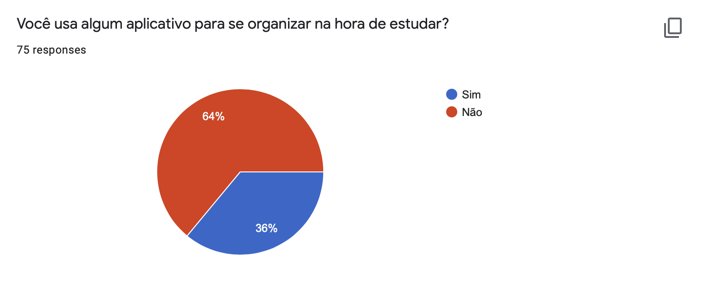
Questão 2
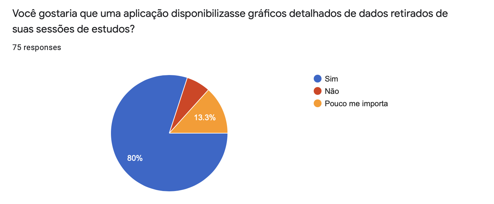
Questão 3
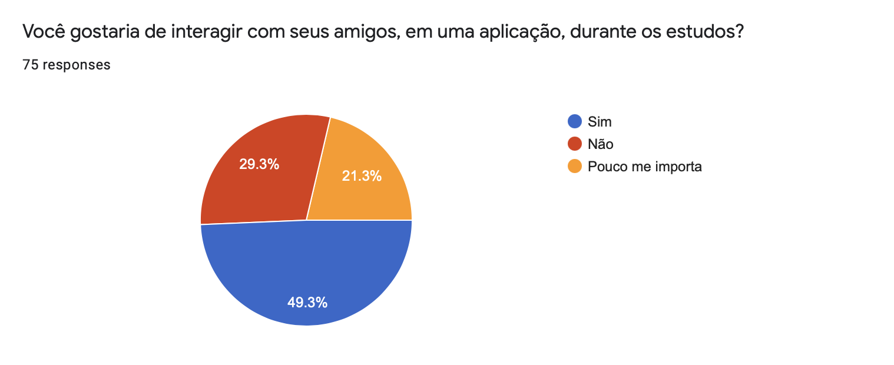
Questão 4
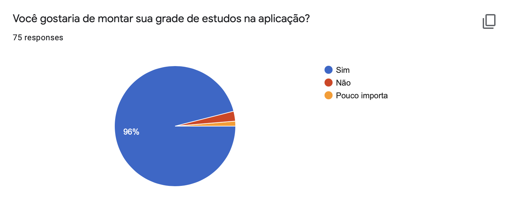
Questão 5
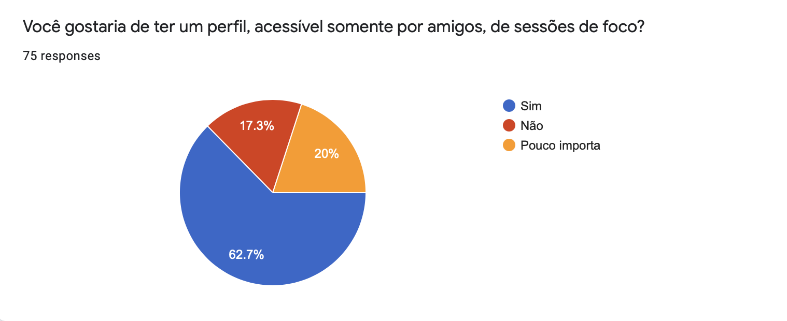
Questão 6
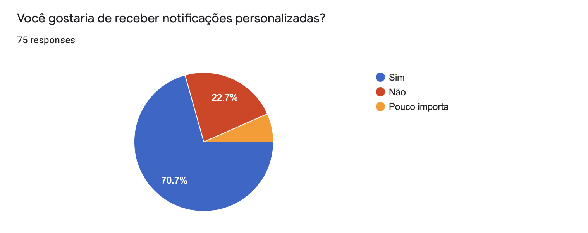
Questão 7
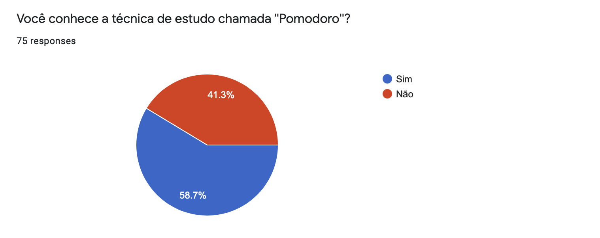
Questão 8
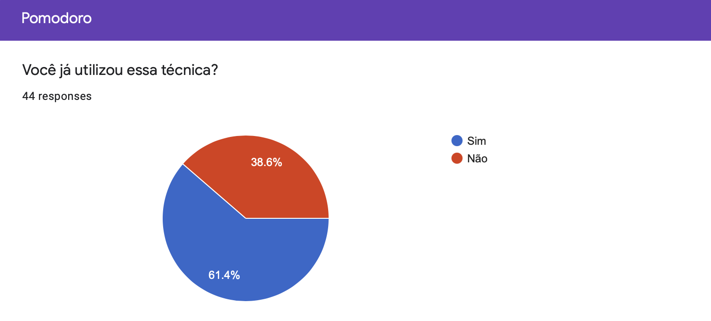
Questão 9 parte 1
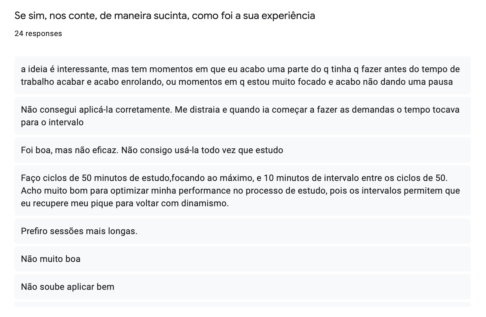
Questão 9 parte 2
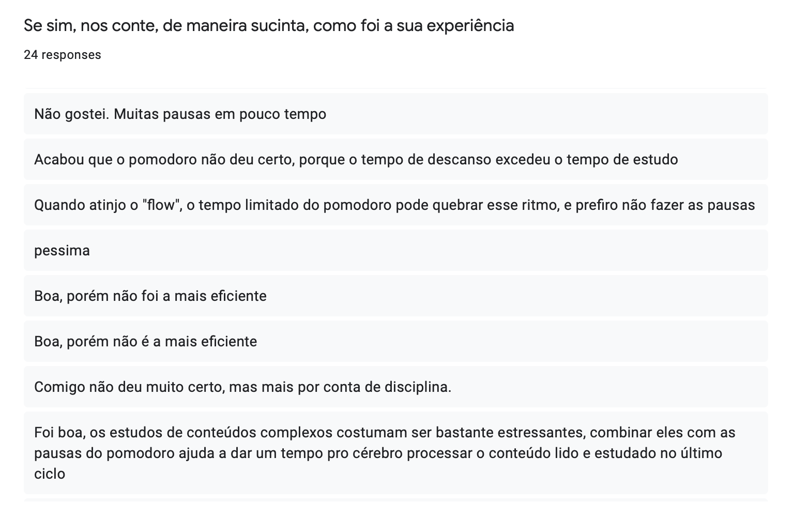
Questão 9 parte 3
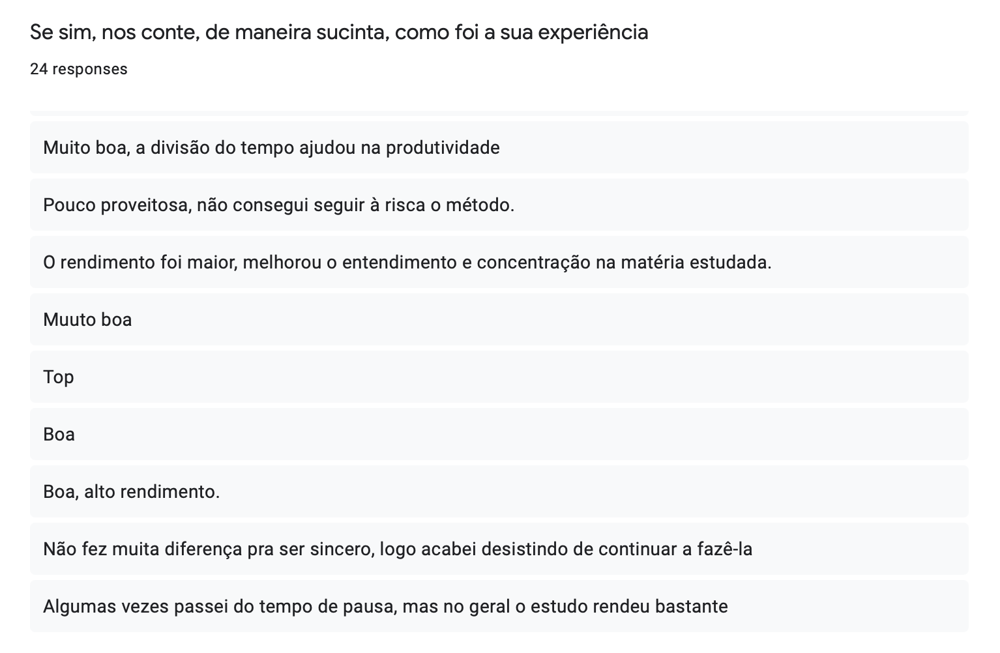
Questão 10
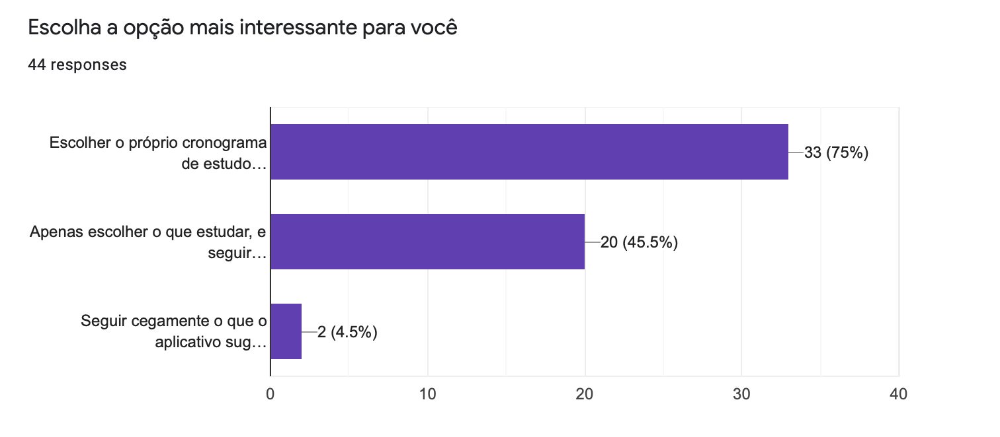
Questão 11
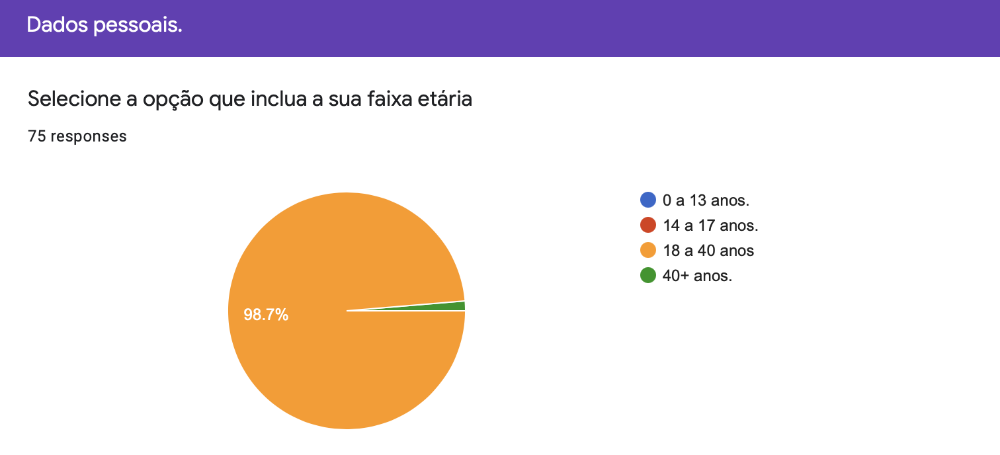
Questão 12
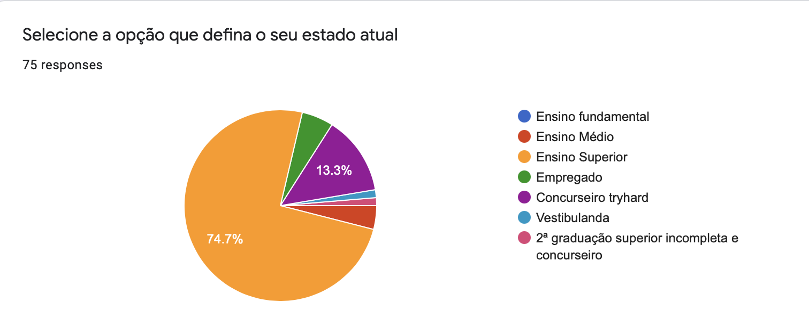
Questão 13
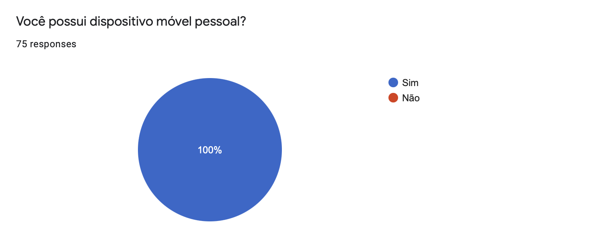
Questão 14
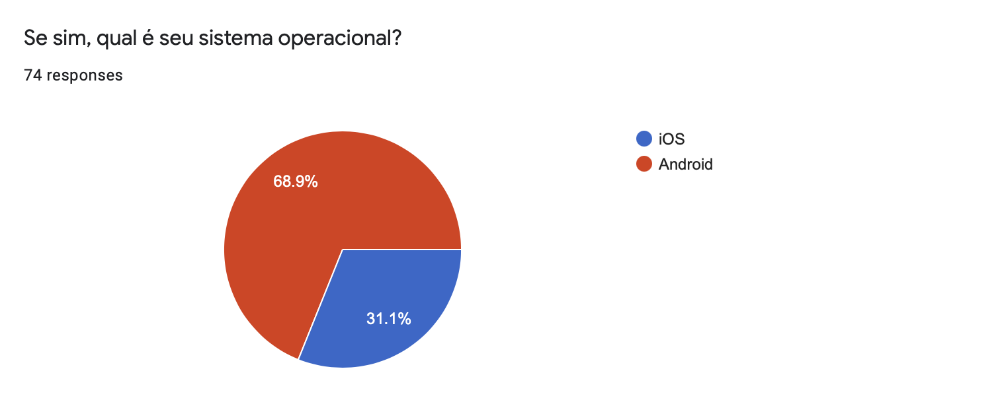
 

## 4. **Requisitos Gerados**
### Requisitos Funcionais
| Código | Descrição | Prioridade |
| -- | -- | -- |
| QRF01 | Gerar gráficos de comportamento de foco. | Must |
| QRF02 | Montar grade de horários de estudo. | Must |
| QRF03 | Possuir perfil de usuário. | Should |
| QRF04 | Gerar notificações personalizadas. | Could |
| QRF05 | Salvar sessões de foco na nuvem. | Must |
| QRF06 | Criar próprios intervalos de estudo e descanso. | Should |

### Requisitos Não Funcionais
| Código | Descrição | Prioridade |
| -- | -- | -- |
| QRNF01 | Habilitar interação social. | Should |
| QRNF02 | Haver maneiras de incentivar realização de tarefas. | Should |
| QRNF03 | Sistema ser mais flexível quanto a horários. | Could |
| QRNF04 | Sistema informar os usuários quanto à técnica utilizada. | Must |

## 5. **Referências**

1. [Zowghi, D.; Coulin, C._Requirements Elicitation: A Survey of Techniques, Aproaches and Tools_.](https://web.eecs.umich.edu/~weimerw/2018-481/readings/requirements.pdf) Acesso em: 08/09/2020.
