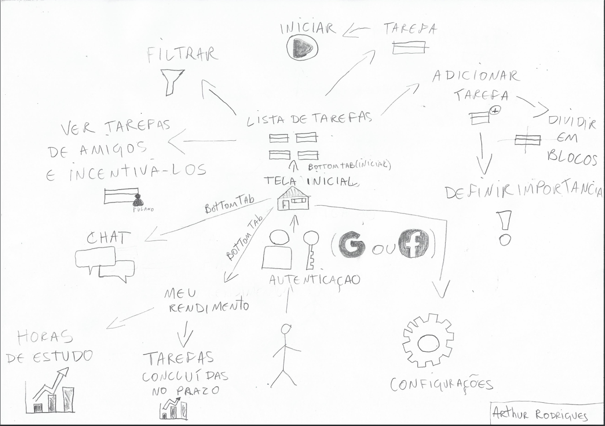
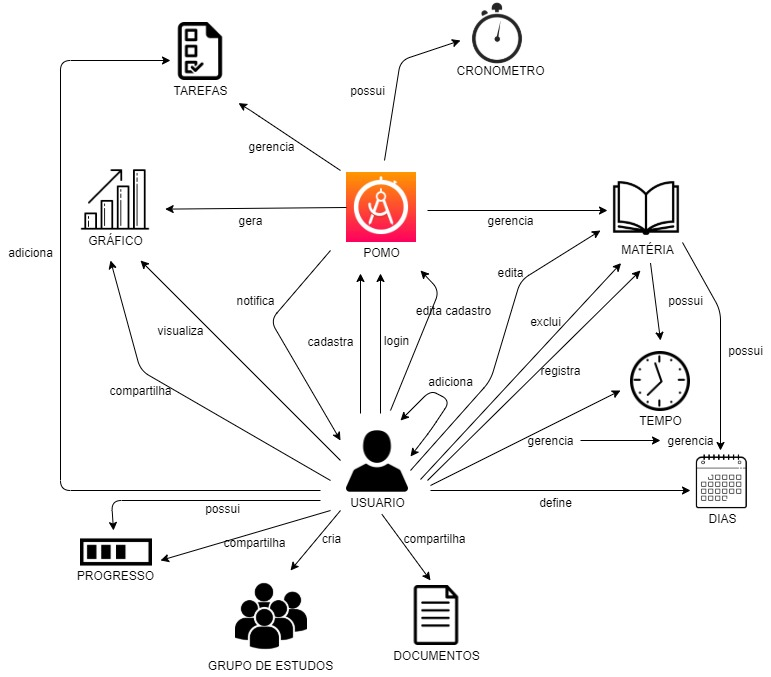

# Rich Picture

## Histórico de revisões

|Data|Versão|Descrição|Autor|
|:---|:---|:---|:---|
|28/08/2020|1.0|Criação da página e adição de conteúdo |Arthur Rodrigues|
|30/08/2020|1.0|Adição de conteudo|Marco Antônio|

## Sumário

1. [Introdução](#1-introdução)
2. [Objetivo](#2-objetivo)
3. [Rich Pictures feitos pela equipe](#3-rich-pictures-feitos-pela-equipe).
4. [Referências](#3-referencias)

### 1. Introdução

O Rich Picture trata-se de uma forma de representar atividades, fluxos e ideias para um processo através de um desenho. Não existe um modelo específico a ser seguido, basta usar uma folha de papel e um lápis ou um computador, ja que é um modelo pouco formal. 
Como o ideal é formar um diagrama visual, é recomendável usar textos curtos e objetivos para explicar uma atividade no desenho.

### 2. Objetivo
Um Rich Picture ajuda a equipe a alcançar um entendimento amplo sobre o tema e enriquece as discussões, o que faz dele um ótimo aliado nas reuniões de elicitação de requisitos de um projeto de software.

### 3. Rich Pictures feitos pela equipe

Arthur Rodrigues

Marco Antônio Costa
### 4. Referências

1. Material Complementar da disciplina Arquitetura e Desenho de Software. VideoAula 02c - DSW - Base - RichPicture. Professora Milene Serrano. Universidade de Brasília.
2. Rich Pictures. BetterEvaluation, 2020. Disponível em <https://www.betterevaluation.org/en/evaluation-options/richpictures>. Acesso em: 28/08/2020.