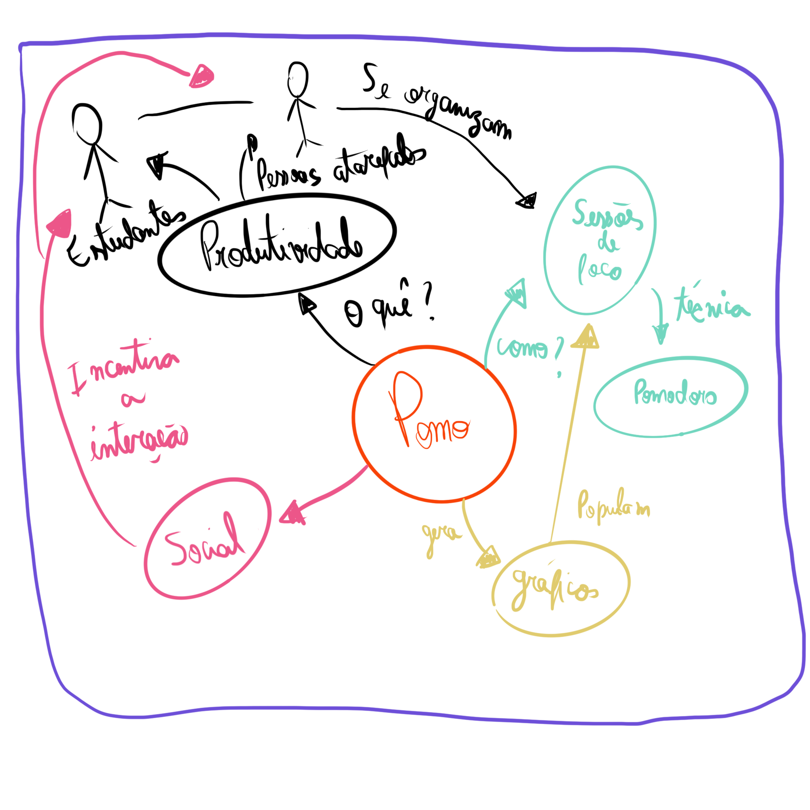
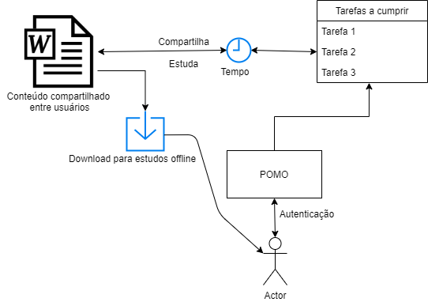
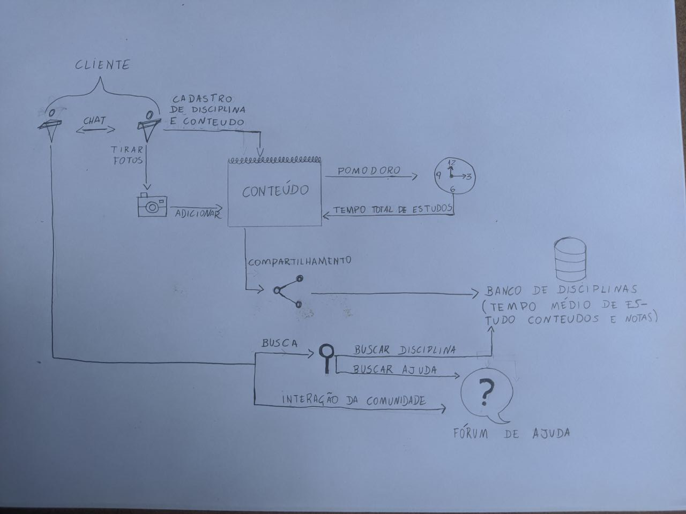

# Rich Picture

## Histórico de revisões

|Data|Versão|Descrição|Autor|
|:---|:---|:---|:---|
|28/08/2020|1.0|Criação da página e adição de conteúdo |[Arthur Rodrigues](https://github.com/arthurarp)|
|30/08/2020|1.1|Adição de conteudo|[Marco Antonio](https://github.com/markinlimac)|
|02/09/2020|1.2|Adição de conteúdo e revisão do documento|[João Gabriel Antunes](https://github.com/flyerjohn)|
|08/09/2020|1.3|Adição de conteúdo e revisão do documento|[Marco Antonio](https://github.com/markinlimac)|

## Sumário

1. [Introdução](#1-introdução)
2. [Objetivo](#2-objetivo)
3. [Rich Pictures feitos pela equipe](#3-rich-pictures-feitos-pela-equipe)
4. [Referências](#4-referências)

### 1. Introdução

O Rich Picture trata-se de uma forma de representar atividades, fluxos e ideias para um processo através de um desenho. Não existe um modelo específico a ser seguido, basta usar uma folha de papel e um lápis ou um computador, ja que é um modelo pouco formal. 
Como o ideal é formar um diagrama visual, é recomendável usar textos curtos e objetivos para explicar uma atividade no desenho.

### 2. Objetivo
Um Rich Picture ajuda a equipe a alcançar um entendimento amplo sobre o tema e enriquece as discussões, o que faz dele um ótimo aliado nas reuniões de elicitação de requisitos de um projeto de software.

### 3. Rich Pictures feitos pela equipe
 
Autor: Arthur Rodrigues 
 
Autor: Marco Antônio Costa 
 
Autor: João Gabriel 
 
Autor: Thallys Braz 
 
Autor: André Eduardo 
### 4. Referências

1. Material Complementar da disciplina Arquitetura e Desenho de Software. VideoAula 02c - DSW - Base - RichPicture. Professora Milene Serrano. Universidade de Brasília.
2. Rich Pictures. BetterEvaluation, 2020. Disponível em <https://www.betterevaluation.org/en/evaluation-options/richpictures>. Acesso em: 28/08/2020.