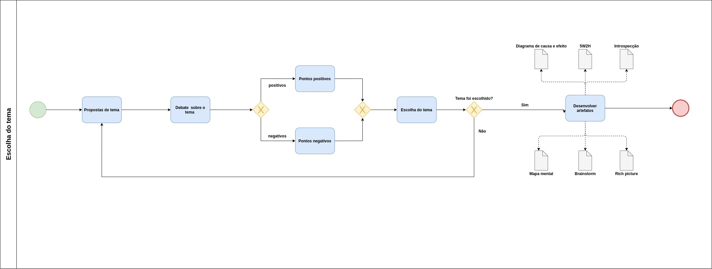
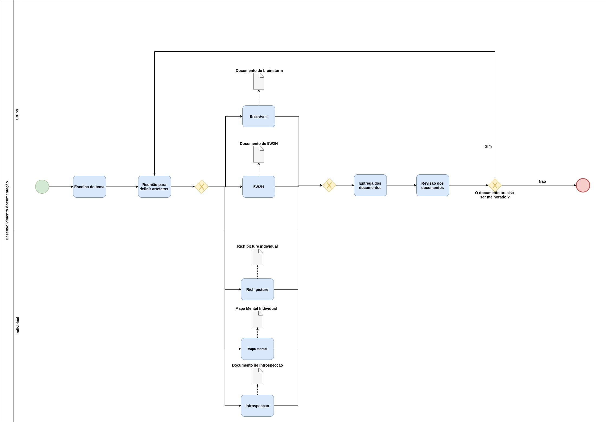

# BPMN'S

## Histórico de revisões

| Data       | Versão | Descrição                              | Autor                                            |
| :--------- | :----- | :------------------------------------- | :----------------------------------------------- |
| 11/09/2020 | 1.0    | Criação da página e adição de conteúdo | [Andé Eduardo](https://github.com/Andre-Eduardo) |

## Sumário

1. [Introdução](#1-introdução)
2. [Objetivo](#2-objetivo)
3. [Modelo de processo - Escolha do tema](#3-modelo-de-processo-Escolha-do-tema)
4. [Modelo de processo - Documentação](#4-Modelo-de-processo-Documentação)
5. [Referências](#5-referências)

### 1. Introdução

A Business Process Modeling Notation (BPMN), ou Notação de Modelagem de Processos de Negócio, é um conjunto de conceitos e técnicas que visam a criação de um modelo com os processos de negócio existentes em uma organização, permitindo uma gestão de processos de negócio.

### 2. Objetivo

Nesta página pode se encontrar os BPMN'S criados pelo grupo, aos quais buscam modelar o processo de desenvolvimento de alguns artefatos.

### 3. Modelo de processo - Escolha do tema

 
Autor: André Eduardo 

### 4. Modelo de processo - Documentação

 
Autor: André Eduardo 

### 5. Referências

BPMN Business Process Modeling Notation. Bizagi Process Modeler. Disponível em: < http://bpmbrasil.com.br/pdf/BPMN_Exemple.pdf> Acesso em: 17 mar. 2013.

SOUZA ROCHA, Carlos André de.; DÁVALOS, Ricardo Villaroel. Fundamentos em Business Process Management (BPM) / Workflow, 2 ed. Palhoça: Unisulvirtual, 2011.

WHITE, Stephen A.. Introduction to BPMN. IBM Corporation. Disponível em: < http://bpmbrasil.com.br/pdf/Introduction_to_BPMN.pdf> Acesso em: 17 mar. 2013.
