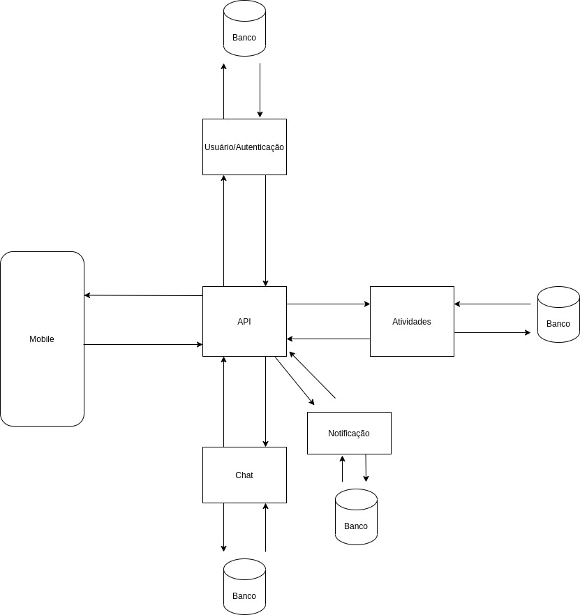

# **Arquitetura POMO**

## Histórico de revisões

|Data|Versão|Descrição|Autor|
|:---:|:---:|:---:|:---:|
|20/09/2020|1.0|Criação da página e adição de conteúdo |[Todos do grupo](https://unbarqdsw.github.io/2020.1_G6_Pomo/)|

Abaixo segue a primeira versão da arquitetura do projeto POMO feita pela equipe de desenvolvimento.

## Mobile

Componente que representa o front no diagrama que fará as principais requisiçṍes para a API.

## API

Componente "cérebro" que irá processar os dados advindos dos serviços e, assim, formatar e padronizar essas informações para comunicação com o frontend.

## Atividades

Componente que irá gerenciar as atividades (CRUD).

## Usuário/ Autenticação

Componente que irá gerenciar os usuários (CRUD).

## Chat

Componente que irá gerenciar as conversas.

## Notificação

Componente que irá gerenciar as notificações.

