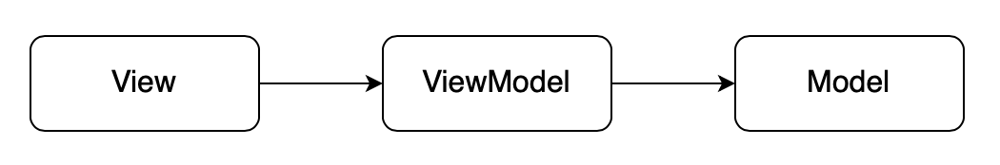

# Arquitetura MVVM

|    Data    | Versão |               Descrição                |                             Autor                             |
| :--------: | :----: | :------------------------------------: | :-----------------------------------------------------------: |
| 16/11/2020 |  1.0   | Criação do artefato | [João Gabriel Antunes](https://github.com/flyerjohn) |
| 16/11/2020 |  1.1   | Adição dos papéis dos componentes do MVVM | [João Gabriel Antunes](https://github.com/flyerjohn)  [Marco Antonio](https://github.com/markinlimac) |

## Introdução

A Apple anunciou o SwiftUI na WWDC 2019 (Worldwide Developers Conference), um framework declarativo para a criação de aplicações nativas para todos os seus aparelhos. Ou seja, isso significa uma nova forma de criar apps, diferente do jeito atual, utilizando Storyboards ou gerando interfaces programaticamente, termos que os desenvolvedores iOS conhecem muito bem.

O SwiftUI não segue o padrão de projeto clássico de desenvolvimento de aplicações, o MVC (Model, View, Controller), ou seja, ao iniciar um novo projeto, utilizando esse framework, no Xcode, IDE dedicada para criação de apps iOS, você não terá nenhuma *controller*. Isso não significa que não é possível utilizar o MVC, porém o MVVM (Model, View, ViewModel) irá satisfazer melhor as necessidades do SwiftUI. 
Mais adiante, esse padrão será dissecado para uma melhor compreensão de seu funcionamento ao lado do novo framework da Apple.

## Motivo para usar MVVM

O principal objetivo do MVVM é separar as lógicas de negócio e de apresentação da Interface de Usuario (UI). Isso melhora a testabilidade e manutenabilidade do projeto à longo prazo, o que geralmente é a chave para um possível projeto de altíssima qualidade.

Para atingir esse objetivo, o MVVM reduz as *"tomadas de decisão"* das **Views** e movem os comportamentos e estados de uma **View** para a **ViewModel**. Dessa forma, as **Views** se tornam passivas, ou seja:
* A **View** não puxa dados da **ViewModel**.
* A **View** não é responsável por se atualizar, conforme a sua **ViewModel**.
* A **View** tem seus estados controlados pela **ViewModel**.

## O Padrão de Projeto MVVM

O MVVM é o padrão de design da Interface de Usuário. Tal como acontece com os sistemas de cliente mais complexos, é aqui que se encontra a grande parte da base de código do aplicativo iOS. Views em SwiftUI, Views em UIKit e View Controllers, Storyboards e Xibs todos pertencem a essa etapa de desenvolvimento.

O MVVM se dispõe de algumas *guidelines* sobre:
* Como exibir informações na UI.
* Como manejar interações entre os usuários e o aplicativo.
* Como interpretar os *inputs* de usuário em ações sobre a lógica de negócio, regras e dados.

Podemos, de maneira simples, dissecar o modelo MVVM em 3 componentes que seguem a seguinte regra de dependência:

As dependências são organizadas da seguinte maneira:
* A **View** depende da **ViewModel**.
* A **ViewModel** depende da **Model**.
* Nem a **ViewModel** ou a **Model** dependem da **View**.

Agora, note que o fluxo de dados é diferente:

Ententendo um pouco melhor a imagem acima, os dados fluem em ambas as direções. A ação começa com uma interação do usuário, que é tratada pela **View**. Logo em seguida, a **View** passa os eventos de interação para a **ViewModel**, então a **ViewModel** traduz esses eventos em operações CRUD(create, read, update and delete) sobre os dados da **Model**.

O fluxo contrário também é válido, como conseguimos ver pelas setas da imagem anterior. A **Model** faz o *fetch* dos dados do *backend*, base de dados ou qualquer outra fonte e passa esses dados para a **ViewModel**, que, logo após recebê-los, prepara-os de forma conveniente para a **View** consumir. Por último, a **View** renderiza esses dados na tela. 
Agora iremos entender um pouco melhor o papel de cada um desses componentes. 

## Model

A **Model** é a representação dos conceitos e regras de negócio do software, que traga algum valor real para o usuário final. Essa é a base sobre a qual qualquer aplicativo iOS é criado. Ainda que o MVVM tenha **Model** como parte do seu nome, esse padrão de projeto não cria nenhuma suposição primordial sobre como ela deve ser implementada, não importando se for algum Redux ou alguma variação de arquiteturas como VIPER.

## View

A **View** renderiza a UI e passa adiante as interações de usuários.

As responsabilidades da **View** são:
* Renderizar UI.
* Realizar animações.
* Encaminhar interações de usuário para a **ViewModel**

## ViewModel

A **ViewModel** representa como os dados devem ser apresentados na **View**, e contém lógica de apresentação.

As responsabilidades da **ViewModel** são:
* Controlar comportamento e estados da UI.
* Interpretar *inputs* de usuários em ações sobre os dados e as regras de negócio. De uma maneira geral, a **ViewModel** mantem uma relação um-pra-muitos com os objetos da **Model**.
* Preparar os dados de uma **Model** para ser apresentada para o usuário. A **ViewModel** estrutura os dados de uma maneira conveniente para a **View** consumir.

## Considerações Finais

A nossa equipe, desde o inicio deste projeto, decidiu desenvolver a aplicação em React Native, focada para o sistema operacional Android, mas também, paralelamente, desenvolver a aplicação em Swift utilizando o framework SwiftUI, focada para o sistema operacional iOS. 
Essa decisão se deu pelo fato de a equipe entender, que mesmo

## Referências

> [Modern MVVM iOS App Architecture with Combine and SwiftUI.](https://www.vadimbulavin.com/modern-mvvm-ios-app-architecture-with-combine-and-swiftui/) Acessado em 16/11/2020.

> [MVVM in SwiftUI.](https://medium.com/flawless-app-stories/mvvm-in-swiftui-8a2e9cc2964a) Acessado em 16/11/2020.