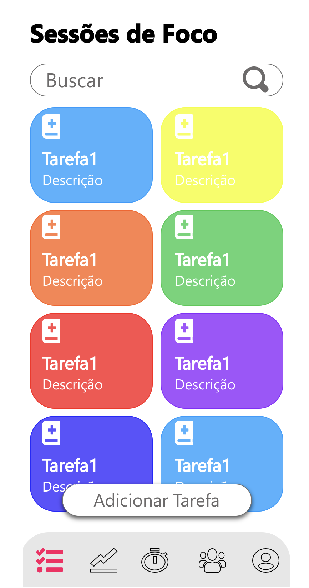
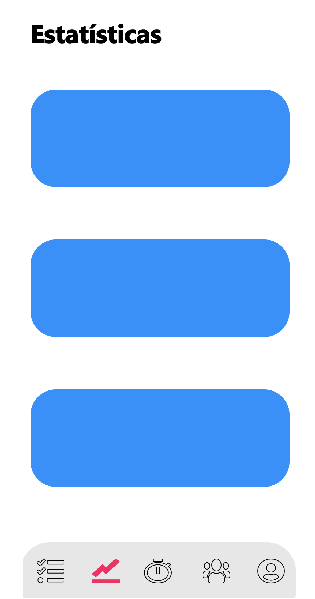
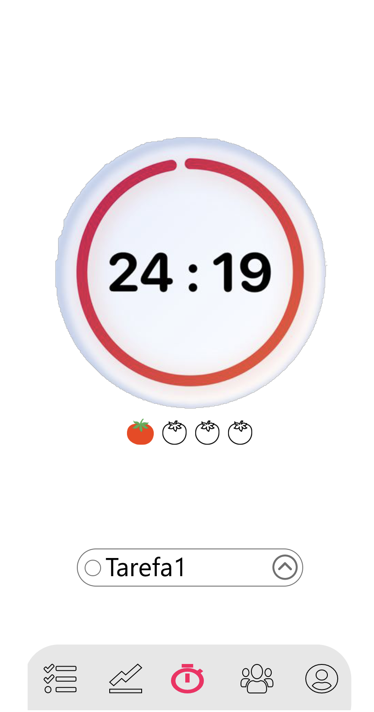
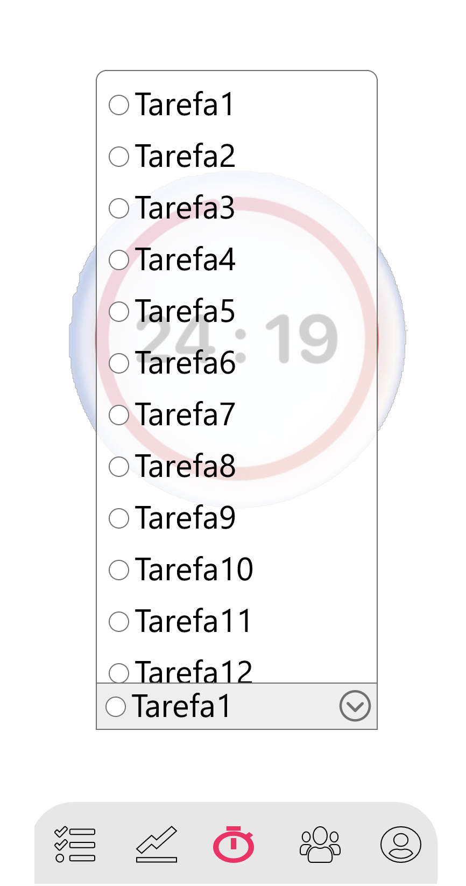
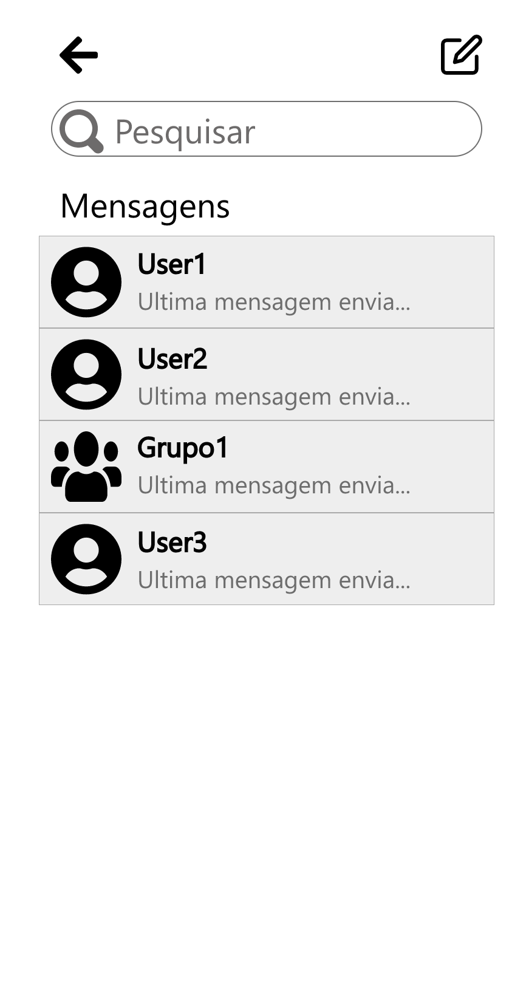
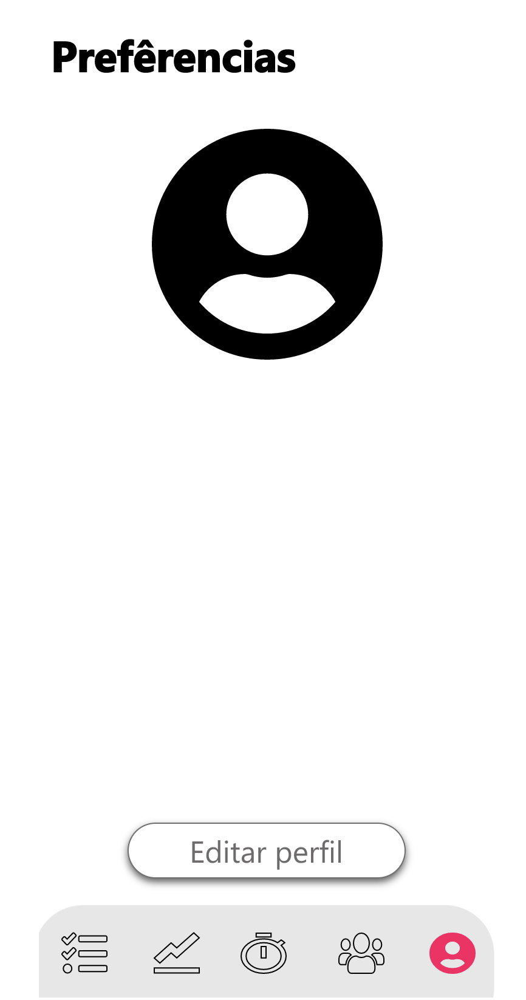

# **Protótipo de Alta Fidelidade**

## Histórico de revisões

|Data|Versão|Descrição|Autor|
|:---:|:---:|:---:|:---:|
|25/09/2020|1.0|Criação da página e adição de conteúdo |[João Gabriel Antunes](https://github.com/flyerjohn)|

# **Sumário**

1. [Introdução](#1-introdução)
2. [Objetivo](#2-objetivo)
3. [Protótipo de alta fidelidade](#3-prototipo-de-alta-fidelidade)
4. [Referências](#4-referências)

### 1. **Introdução**
Prototipação é uma técnica que visa simular as características funcionais de um produto. Neste documento, focaremos, agora, na confecção do protótipo de alta fidelidade, adaptando e melhorando as ideias coletadas com os protótipo de baixa fidelidade. A principal das características desse artefato é o fato dele tentar ser o mais próximo ao produto final possível, para que o desenvolvimento seja altamente focado nas etapas futuras do projeto.

### 2. **Objetivo**

O objetivo da prototipação de alta fidelidade é criar uma versão real e testável para o cliente e colher o seu feedback, após os inumeros briefings nas etapas de baixa e média fidelidade. A partir dessa etapa, as mudanças de funcionalidades e visual ainda são bem-vindas, ainda que precisem ser mais necessárias, pela solidez do projeto.

### 3. **Protótipos de alta fidelidade**
[Link para versão interativa](https://xd.adobe.com/view/d07357d6-f19a-4ba4-6fd8-17e4fc7f6c93-a642/?fullscreen&hints=off)
|Autor(es)|Versão|Versões Anteriores|
:------:|:------:|:-------:
|[Equipe](https://github.com/ArqDsw/2020.1_G6_Pomo)| 1.0 | ----

#### 3.1 Tela 1

#### 3.2 Tela 2

#### 3.3 Tela 3.1

#### 3.4 Tela 3.2

#### 3.5 Tela 4

#### 3.6 Tela 5

#### 3.7 Tela 6

#### 3.8 Tela 7

### 4. **Referências**
1. [Prototipagem de alta fidelidade: o que é, quando, por que e como usar?](https://medium.com/somos-tera/prototipagem-de-alta-fidelidade-635d745b662b). Acesso em: 23/09/2020.
2. [High-fidelity prototyping: What, When, Why and How?](https://blog.prototypr.io/high-fidelity-prototyping-what-when-why-and-how-f5bbde6a7fd4). Acesso em: 25/09/2020.