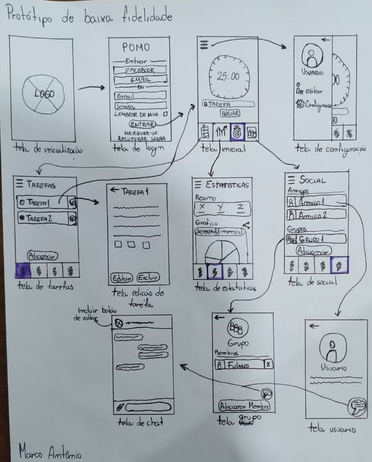

# **Protótipo de Baixa Fidelidade**

## Histórico de revisões

|Data|Versão|Descrição|Autor|
|:---:|:---:|:---:|:---:|
|22/09/2020|1.0|Criação da página e adição de conteúdo |[Arthur Rodrigues](https://github.com/arthurarp)|
|22/09/2020|1.1|adição de um protótipo|[Marco Antônio](https://github.com/markinlimac)|
|22/09/2020|1.2|Adição de um protótipo|[Arthur Rodrigues](https://github.com/arthurarp)|

## **Sumário**

1. [Introdução](#1-introdução)
2. [Objetivo](#2-objetivo)
3. [Protótipo de baixa fidelidade](#3-protótipos-de-baixa-fidelidade)
4. [Referências](#4-referências)

### 1. **Introdução**
Prototipação é uma técnica que visa simular as características funcionais de um produto. Neste documento, focaremos nos protótipos de baixa fidelidade, que tem um foco maior nas funcionalidades e não na estética do software. Umas das características principais desse artefato é o fato dele ser simplista, ou seja, pode ser feito até mesmo à mão e também o fato dele não ser dinâmico.

### 2. **Objetivo**

O objetivo da prototipação de baixa fidelidade é criar uma versão básica testável para o cliente e colher o seu feedback. É muito usado para aplicações que contenham interface de uso, serve para melhorar, alterar ou incrementar uma solução que será lançada posteriormente.

### 3. **Protótipos de baixa fidelidade**

|Autor(es)|Versão|Versões Anteriores|
:------:|:------:|:-------:
|[Marco Antônio](https://github.com/markinlimac)| 1.0 | ----

 

|Autor(es)|Versão|Versões Anteriores|
:------:|:------:|:-------:
|[Arthur Rodrigues](https://github.com/arthurarp)| 1.0 | ----

### 4. **Referências**

1. ALEX, Jefferson. Protótipos de baixa, média e alta fidelidade. Medium, Junho de 2019. Disponível em: <https://medium.com/@jeffersonalex/prot%C3%B3tipos-de-baixa-m%C3%A9dia-e-alta-fidelidade-bf04870325a6>. Acesso em: 22/09/2020.

2. Vieira, Danielle. Startup Sorocaba: O que são protótipos de baixa e alta fidelidade?. Startup Sorocaba. Disponível em: <https://startupsorocaba.com/startup-sorocaba-o-que-sao-prototipos-de-baixa-e-alta-fidelidade/>. Acesso em: 22/09/2020.
