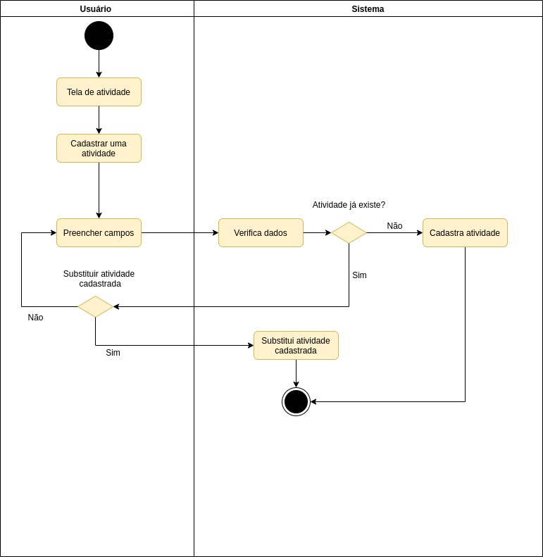
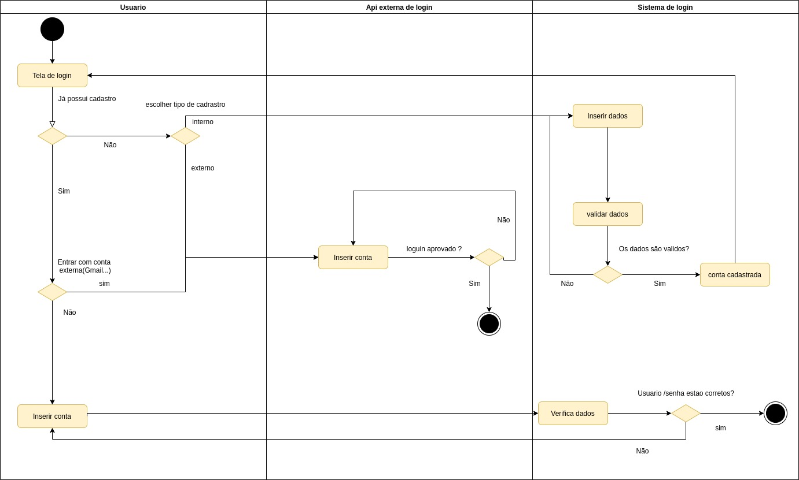

# Diagrama de atividades

## Histórico de revisões

| Data       | Versão | Descrição                              | Autor                                            |
| :--------- | :----- | :------------------------------------- | :----------------------------------------------- |
| 24/09/2020 | 1.0    | Criação da página e adição de conteúdo | [Andé Eduardo](https://github.com/Andre-Eduardo) |

## Sumário

1. [Introdução](#1-introdução)
2. [Objetivo](#2-objetivo)
3. [Cadrastro de atividades](#3-Cadrastro-de-atividades)
4. [Login no sistema](#4-Login-no-sistema)
5. [Criar Agenda de tarefas](5-Criar-Agenda-de-tarefas)
6. [Referências](#6-referências)

### 1. Introdução

O diagrama de atividades ilustra graficamente como será o funcionamento do software em varios niveis de detalhamento, como será a execução de alguma de suas partes, como será a atuação do sistema na realidade de negócio na qual ele está inserido.

### 2. Objetivo

O diagrama de atividades, como citado, tem como objetivo principal a especificação do comportamento do software, do ponto de vista funcional, ou seja, das suas funcionalidades.
Como para qualquer outro modelo que segue a notação UML, o objetivo de um diagrama é especificar o que será posteriormente projetado, ou diretamente construído, diminuindo assim o nível de abstração do escopo, facilitando o entendimento sobre o que tem ser feito pelo programador.

### 3. Cadrastro de atividades

 
Autor: André Eduardo 

### 4. Login no sistema

/ 
Autor: André Eduardo 

### 5. Criar Agenda de tarefas

/ 
Autor: André Eduardo 

### 6. Referências

Ventura, Plinio. Entendendo o Diagrama de Atividades da UML. Ate o momento, 2019. Disponível em: <https://www.ateomomento.com.br/uml-diagrama-de-atividades>. Acesso em: 24, setembro de 2021.
