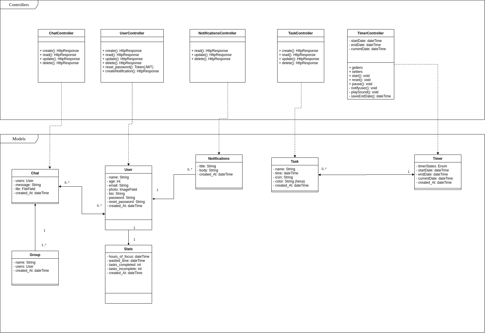

# **Diagrama de classes**

## Histórico de revisões

|Data|Versão|Descrição|Autor|
|:---:|:---:|:---:|:---:|
|28/09/2020|1.0|Criação da página e adição de conteúdo|Equipe|

## **Sumário**

1. [Introdução](#1-introdução)
2. [Objetivo](#2-objetivo)
3. [Diagramas](#3-diagramas)
4. [Referências](#4-referencias)

### 1. **Introdução**

Diagramas de classes estão entre os tipos mais úteis de diagramas UML pois mapeiam de forma clara a estrutura de um determinado sistema ao modelar suas classes, seus atributos, operações e relações entre objetos. É um tipo de diagrama da estrutura porque descrevem o que deve estar presente no sistema a ser modelado. Não importa seu nível de familiaridade com diagramas UML ou de classe.

A forma de classe em si consiste em um retângulo com três linhas. A linha superior contém o nome da classe, a linha do meio, os atributos da classe e a linha inferior expressa os métodos ou operações que a classe pode utilizar. Classes e subclasses são agrupadas juntas para mostrar a relação estática entre cada objeto.

### 2. **Objetivo**
Diagramas de classes oferecem uma série de benefícios para qualquer organização. Os principais são:

- Ilustrar modelos de dados para sistemas de informação, não importa quão simples ou complexo.
- Entender melhor a visão geral dos esquemas de uma aplicação.
- Expressar visualmente as necessidades específicas de um sistema e divulgar essas informações por toda a empresa.
- Criar gráficos detalhados que destacam qualquer código específico necessário para ser programado e implementado na estrutura descrita.
- Fornecer uma descrição independente de implementação de tipos utilizados em um sistema e passados posteriormente entre seus componentes.

### 3. **Diagramas**

|Autor(es)|Versão|Versões Anteriores|
:------:|:------:|:-------:
Equipe | 1.0 | ----

 

### 4. **Referências**

1. Módulo Projeto Orientado a Abordagens Tradicionais
Notação UML - Modelagem Estática. VideoAula 05b - DSW - Modelagem - Diagrama de classes. Professora Milene Serrano. Universidade de Brasília.
2. O que é um diagrama de classe UML?. Lucidchart. Disponível em: <https://www.lucidchart.com/pages/pt/o-que-e-diagrama-de-classe-uml>. Acesso em: 28/09/2020.