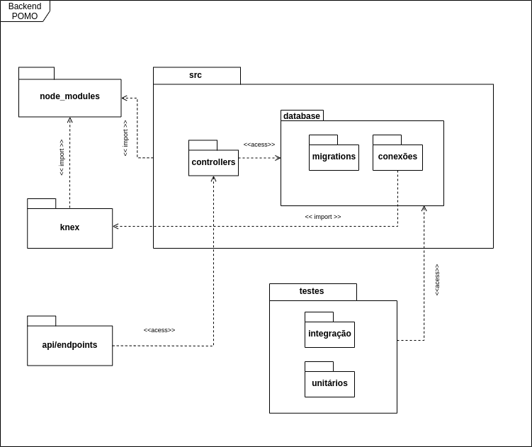

# **Diagrama de pacotes**

## Histórico de revisões

|Data|Versão|Descrição|Autor|
|:---:|:---:|:---:|:---:|
|28/09/2020|1.0|Criação da página e adição de conteúdo |[Arthur Rodrigues](https://github.com/arthurarp)|

## **Sumário**

1. [Introdução](#1-introdução)
2. [Objetivo](#2-objetivo)
3. [Diagramas](#3-diagramas)
4. [Referências](#4-referencias)

### 1. **Introdução**
Diagramas de pacotes são diagramas estruturais usados para mostrar, em uma forma de pacotes, a organização e disposição de vários elementos de modelos. Um pacote é um agrupamento de elementos UML relacionados, como diagramas, documentos, classes ou até mesmo outros pacotes. Cada elemento é colocado dentro do pacote e é representado como uma pasta de arquivo dentro do diagrama, e depois organizado hierarquicamente no diagrama. Diagramas de pacotes são bastante usados para proporcionar uma organização visual de uma arquitetura em camadas de qualquer classificador UML, por exemplo, um sistema de software. [[2]](#4-referencias)

### 2. **Objetivo**
Um diagrama de pacotes bem projetado oferece inúmeros benefícios para quem precisa de uma visualização de seu sistema ou projeto UML.

- fornece uma visão clara da estrutura hierárquica dos variados elementos UML dentro de um determinado sistema. 

-  simplifica diagramas de classes complexos, criando elementos visuais organizados.

-  oferecem uma ótima visibilidade geral de projetos e sistemas de grande escala.

- são usados para esclarecer de forma visual uma grande variedade de projetos e sistemas.

- elementos visuais podem ser atualizados com facilidade conforme a evolução dos sistemas e projetos. [[2]](#4-referencias)

### 3. **Diagramas**

#### **Backend**

|Autor(es)|Versão|Versões Anteriores|
:------:|:------:|:-------:
Arthur Rodrigues | 1.0 | ----

 

### 4. **Referências**

1. Módulo Projeto Orientado a Abordagens Tradicionais
Notação UML - Modelagem Estática. VideoAula 05g - DSW - Modelagem - Diagrama de pacotes. Professora Milene Serrano. Universidade de Brasília.
2. Tudo sobre diagramas de pacotes UML. Lucidchart. Disponível em: <https://www.lucidchart.com/pages/pt/diagrama-de-pacotes-uml>. Acesso em: 28/09/2020.