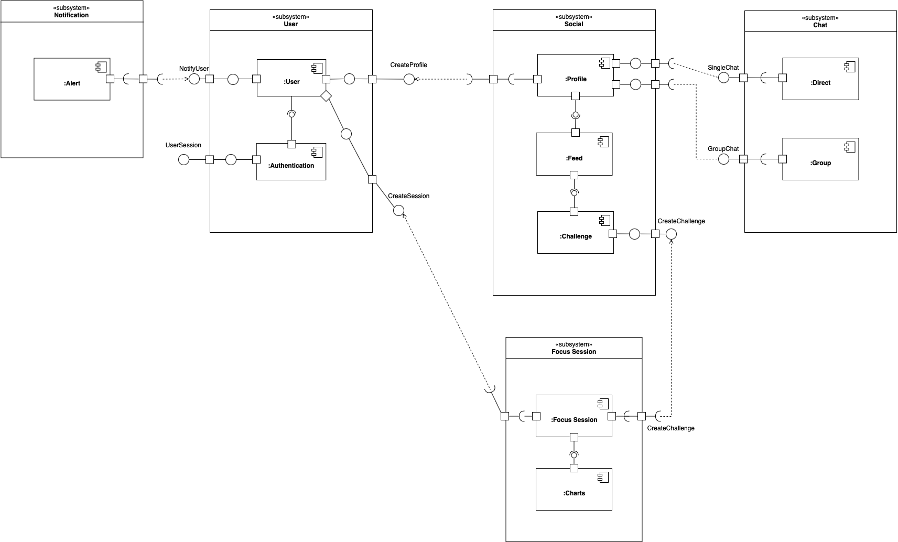

# Diagrama de Componentes

## **Histórico de revisões**
|Data|Versão|Descrição|Autor|
|:---|:---|:---|:---|
|21/09/2020|1.0|Criação do artefato primordial.|[João Gabriel Antunes](https://github.com/flyerjohn)|

## Introdução

&emsp;&emsp;O diagrama de componentes mostra o relacionamento entre diferentes componentes de um sistema. Para fins de UML 2.0, o termo "componente" refere-se a um módulo de classes que representa sistemas ou subsistemas independentes com capacidade de interagir com o restante do sistema.  

&emsp;&emsp;Esse artefato é essencial para criar um sistema de software. Ele pode ser feito usando um software de diagramação UML, e ajuda a equipe a entender a estrutura de sistemas existentes e a criar sistemas novos. 

## Diagrama

## Notas Finais

&emsp;&emsp; Com o diagrama de componentes, o grupo de desenvolvimento irá ter uma visão mais clara das relações e comunicações entre os componentes e subsistemas da aplicação. É notável, apenas, que esse artefato seja atualizado conforme novos componentes e subsistemas sejam, ocasionalmente, adicionados a nível de código, ou seja, esse diagrama nunca será definitivo.

## Referências
1. [UML Diagrams](https://www.uml-diagrams.org). Acesso em 20/09/2020.
2. [Diagrama de componentes - Lucidchart](https://www.lucidchart.com/pages/pt/diagrama-de-componentes-uml). Acesso em 21/09/2020
3. Material Complementar da disciplina Arquitetura e Desenho de Software. VideoAula 05h - DSW - Modelagem - Diagrama de Componentes. Professora Milene Serrano. Universidade de Brasília.
