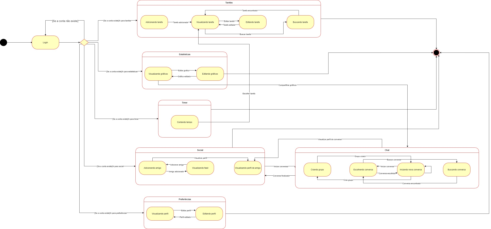

# Diagrama de estados

## Histórico de revisões

| Data       | Versão | Descrição                              | Autor                                            |
| :--------- | :----- | :------------------------------------- | :----------------------------------------------- |
| 27/09/2020 | 1.0 | Criação da página e adição de conteúdo | [Marco Antônio](https://github.com/markinlimac) |

## Introdução

Diagrama de estados é um diagrama dinâmico que procura apresentar os vários estados pelos quais um objeto pode passar. Ao longo do tempo, um objeto muda de estado quando acontece algum evento interno ou externo ao sistema.

## Diagrama de estado
### Geral
 
Autor: Marco Antônio 

## Referências

Abdala, Daniel. Diagrama de Estados. PDF, 2021. Disponível em: <http://www.facom.ufu.br/~abdala/DAS5312/Diagrama%20de%20Estados.pdf>. Acesso em: 27, setembro de 2021.
