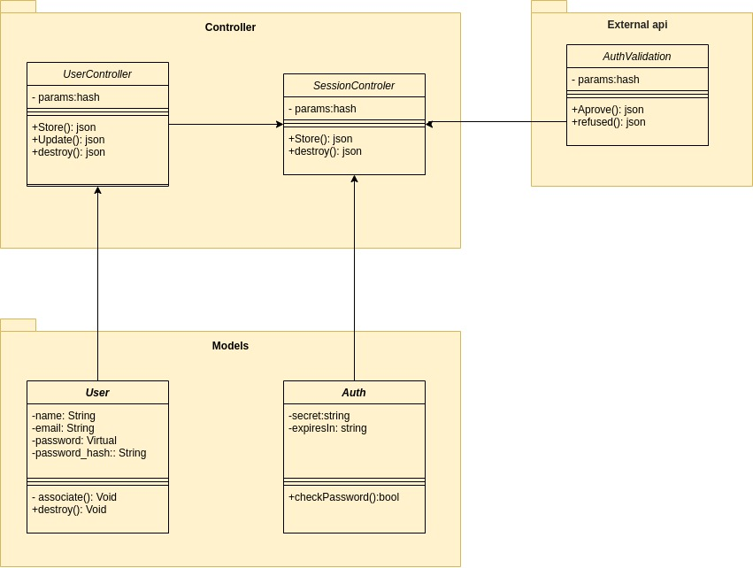

# GRASPs

## Histórico de revisões

| Data       | Versão | Descrição          | Autor                                             |
| :--------- | :----- | :----------------- | :------------------------------------------------ |
| 19/10/2020 | 1.0    | Criação do arquétipo do documento  | [João Gabriel Antunes](https://github.com/flyerjohn) |
| 21/10/2020 | 1.1    | Adição de conteúdo | [João Gabriel Antunes](https://github.com/flyerjohn) |
| 21/10/2020 | 1.2    | Adição das definições controlador, criador e especialista | [João Gabriel Antunes](https://github.com/flyerjohn) |
| 21/10/2020 | 1.3    | Adição da aplicação do padrão controlador | [João Gabriel Antunes](https://github.com/flyerjohn) |

## 1. Introdução
Padrões de projeto (design patterns) são soluções típicas para problemas comuns em projeto de software. Cada padrão é como uma planta de construção que você pode customizar para resolver um problema de projeto particular em seu código. Padrões são como um conjunto de ferramentas para soluções de problemas comuns em design de software, ou seja, eles definem uma linguagem comum que ajuda a equipe a se comunicar mais eficientemente, e portanto, aumentando seu desempenho cotidiano.

## 2. Definições
Os GRASPs, da sigla em inglês para ***General responsibility assignment software patterns***, consistem em diretrizes para atribuir responsabilidade a classes e objetos em um projeto orientado a objetos, como é o caso do Pomo.
Os diferentes padrões e princípios utilizados no GRASP são: *controller* (controlador), *creator* (criador), *indirection* (indireção), *information expert* (especialista), alta coesão, baixo acoplamento, polimorfismo, *pure fabrication* (fabricação/invenção pura) e *protected variations* (variações protegidas). Todos esses padrões respondem a algum problema, e esses problemas são comuns a quase todos os projetos de desenvolvimento de software. Essas técnicas não foram inventadas a fim de criar novas formas de trabalho, mas para melhor documentar e padronizar os antigos e amplamente praticados princípios de programação em padrões orientado a objetos.
  
**GRASP Criador**  
A criação de objetos é uma das mais comuns atividades em um sistema orientado a objetos. Descobrir qual classe é responsável por criar objetos é uma propriedade fundamental da relação entre objetos de classes particulares.

Em geral, uma classe **B** deve ser responsável por criar instâncias de classe **A** se uma, ou preferencialmente mais, das seguintes afirmações se aplicam: 
* Instâncias de **B** contêm ou agregam instâncias de **A**;
* Instâncias de **B** gravam instâncias de **A**;
* Instâncias de **B** utilizam de perto instâncias de **A**;
* Instâncias de **B** têm as informações de iniciação das instâncias de **A** e passam isso na criação. 

**GRASP Controlador** 
Esse foco atribui a responsabilidade de manipular eventos do sistema para uma classe que não seja de interface do usuário (UI) que representa o cenário global ou cenário de caso de uso. Um objeto controlador é um objeto de interface não-usuário, responsável por receber ou manipular um evento do sistema.
Um caso de uso controlador deve ser usado para lidar com todos os eventos de casos de uso e pode ser usado para mais de um caso de uso (por exemplo, para casos de uso como Criar usuário e Excluir usuário, pode ter um único UserController, em vez de dois casos de user controllers separados).

É definido como o primeiro objeto além da camada UI que recebe e coordena ("controla") operações do sistema. O controlador deve delegar o trabalho que precisa ser feito para outros objetos; ele coordena ou controla a atividade, no entanto ele não deve fazer muito trabalho por si próprio. O GRASP Controlador pode ser considerado uma parte da camada de aplicação/serviço (assumindo que a aplicação tenha feito uma distinção explícita entre a camada de aplicativo/serviço e a camada de domínio em um sistema orientado a objetos com camadas comuns em uma arquitetura lógica do sistema de informações).
 

**GRASP Especialista** 
O GRASP Especialista é outro vital princípio, que é amplamente utilizado para determinar onde delegar responsabilidades, ou seja, atribuir da mais correta, específica maneira as responsabilidades para as respectivas entidades do projeto. Essas responsabilidades incluem métodos, campos computados, e assim em diante. 

Usando o princípio especialista, uma abordagem geral para atribuir responsabilidades é olhar para uma determinada responsabilidade, determinar a informação necessária para cumpri-la e depois determinar onde essa informação deverá ser armazenada ou computada. O especialista colocará a responsabilidade na classe com a maioria das informações necessárias para cumpri-la.
 

**GRASP Demais Padrões** 
Existem vários outros padrões GRASPs, que são utilizados para resolver casos e problemas localizados a certos tipos de contextos, como a *Pure Fabrication* ou pura fabricação, que é basicamente uma classe artificial que não representa um conceito no domínio do problema, ela funciona mais como um serviço acoplado à solução do projeto principal. 
Há outros muito conhecidos, e quase que utilizados 100% das vezes que uma equipe escolhe desenvolver projetos orientados a objetos, como o Polimorfismo, que permite a criação de uma comunicabilidade entre superclasses e subclasses, ou classes mães e filhas, podendo assim haver sobreescrita e sobrecarga de métodos, conforme essa mutação dos metodos forem necessárias nas classes filhas.
 

## 3. Aplicações
Nesta sesssão iremos mostrar, de maneira sucinta, a aplicação de alguns dos padrões GRASPs no Pomo. 

**GRASP Controlador:** 
O padrão controlador está presente de maneira arquétipa, anatômica no projeto Pomo, ou seja, toda a organização da aplicação se da pelo exemplo mais famoso do controlador, que é o MVC, do inglês *Model View Controller*. Iremos demonstrar também que o controlador está altamente relacionado com o criador e especialista, formando assim o MVC da aplicação.
* Exemplo implementado: 

## 4. Referências
> Larman, Craig; 2005. [Applying UML and Patterns – An Introduction to Object-Oriented Analysis and Design and Iterative Development 3rd ed](https://www.informit.com/promotions/phptr-author-supplements-141295?utm_source=authors.phptr.com). New Jersey: Prentice Hall. ISBN 0-13-148906-2. Acesso em 20/10/2020.