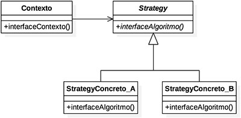
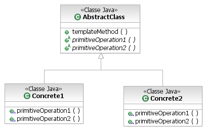

# GoFs Comportamentais

## Histórico de revisões

| Data       | Versão | Descrição          | Autor                                          |
| :--------- | :----- | :----------------- | :--------------------------------------------- |
| 21/10/2020 | 1.0    | Adição de conteúdo | [Thallys Braz](https://github.com/thallysbraz) |

### 1. Introdução

Padroes de projeto são soluções para problemas comuns que encontramos no desenvolvimento ou manutenção de um software orientado a objetos.
Os padrões comportamentais são padrões voltados para alterações no nível do comportamento dos objetos. Auxiliam quando é necessário, por exemplo, usar vários algoritmos diferentes, cada qual mais apropriado para um determinado contexto. Permitem, nesse caso, usar mecanismos/recursos para facilitar tanto a incorporação de novos algoritmos para novos contextos quanto a seleção de qual algoritmo usar dado um contexto.

### 2. Resutados

### Strategy

Strategy é um padrão que pode ser chamado de policy. De modo que delega as responsabilidades adquiridas pelas entidades, atribuindo, portanto, o comportamento. Assim a comunicação entre os objetos é aprimorada, pois há a distribuição das responsabilidades. O objetivo é representar uma operação a ser realizada sobre os elementos de uma estrutura de objetos. O padrão Strategy permite definir novas operações sem alterar as classes dos elementos sobre os quais opera. Segundo o catálogo GOF o padrão tem como meta: "Definir uma família de algoritmos, encapsular cada uma delas e torná-las intercambiáveis. Strategy permite que o algoritmo varie independentemente dos clientes que o utilizam."
 

**Estrutura:** 
 

**Benefícios:**

- Definir uma família de algoritmos. 
- Encapsular cada algoritmo como uma classe. 
- Permitir que eles possam ser trocados entre si. 
- Permitir que o algoritmo possa variar independentemente dos clientes que o utilizam.. 

#### Aplicabilidade:

Este padrão é adequado para situações onde muitas classes estão relacionadas e diferem apenas na forma de comportamento. Esta estratégia irá configurar uma classe com um dos vários comportamentos fornecidos. Você também pode usá-lo quando precisar alterar o algoritmo, ou seja, pode implementar diferentes códigos que atinjam o mesmo objetivo, mas em alguns casos tem vantagens sobre outros.  
Outra situação adequada para usar esse padrão é em um aplicativo onde você tem um cliente e o cliente não pode expor a estrutura de dados do algoritmo. Além disso, quando uma classe tem muitos comportamentos e usa vários comandos condicionais, a velocidade do código pode ser reduzida devido a um grande número de condições, de modo que o desempenho do algoritmo pode não ser satisfatório. Usando esse padrão, você pode excluir condições e usar essas estratégias para criar novas classes para melhorar o desempenho.

#### Implementação no Pomo:

Até o momento não foi encontrado aplicações do padrão dentro do Pomo

### Template Method

Um Template Method auxilia na definição de algoritmos, parte dos quais é definida por métodos abstratos. As subclasses devem ser responsáveis ​​por essas partes abstratas desse algoritmo, que podem ser implementadas de diversas maneiras, ou seja, cada subclasse atenderá aos seus requisitos e fornecerá comportamentos específicos para a construção de todo o algoritmo.  
Fornece uma estrutura fixa do algoritmo. A parte fixa deve existir na superclasse. É uma classe Abstract obrigatória que pode conter métodos concretos. Como a interface só pode conter métodos abstratos que definem o comportamento, esta é a vantagem de se tornar uma classe Abstract. Como ele também fornecerá métodos abstratos para suas subclasses, essas subclasses herdaram esse método por herança (programação) e devem implementar métodos abstratos para fornecer comportamentos concretos para métodos definidos como abstratos. Desta forma, algumas partes do algoritmo serão preenchidas pela implementação alterada, ou seja, o algoritmo é implementado no método, o que atrasa a definição de certas etapas do algoritmo para que outras classes possam redefini-las.  

**Estrutura:** 
 

**Benefícios:**

- Definir uma família de algoritmos. 
- Encapsular cada algoritmo como uma classe. 
- Permitir que eles possam ser trocados entre si. 
- Permitir que o algoritmo possa variar independentemente dos clientes que o utilizam.. 

#### Aplicabilidade:

- Para implementar partes invariantes de um algoritmo uma única vez e deixar subclasses implementarem o comportamento variável.  
- Quando comportamento comum entre subclasses deveria ser fatorado e localizado numa classe comum para evitar duplicação. É um passo freqüente de "refactoring" de código.  
- Para controlar extensões de subclasses.  

#### Implementação no Pomo:

Até o momento não foi encontrado aplicações do padrão dentro do Pomo

### 3. Referências

Design Patterns. Refactoring Guru, 2014. Disponível em: <https://refactoring.guru/pt-br/design-patterns/creational-patterns>. Acesso em: 20, outubro de 2020.
