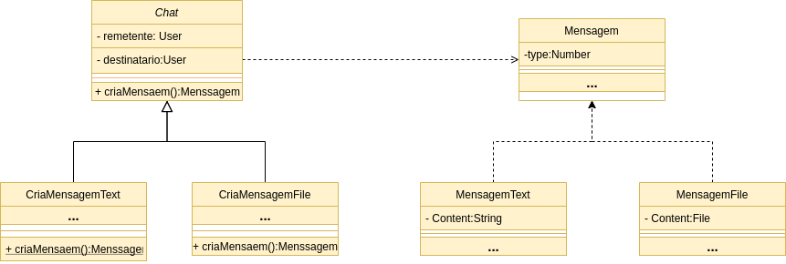

# GoFs Comportamentais

## Histórico de revisões

| Data       | Versão | Descrição          | Autor                                          |
| :--------- | :----- | :----------------- | :--------------------------------------------- |
| 21/10/2020 | 1.0    | Adição de conteúdo | [Thallys Braz](https://github.com/thallysbraz) |

### 1. Introdução

Padroes de projeto são soluções para problemas comuns que encontramos no desenvolvimento ou manutenção de um software orientado a objetos.
Os padrões comportamentais são padrões voltados para alterações no nível do comportamento dos objetos. Auxiliam quando é necessário, por exemplo, usar vários algoritmos diferentes, cada qual mais apropriado para um determinado contexto. Permitem, nesse caso, usar mecanismos/recursos para facilitar tanto a incorporação de novos algoritmos para novos contextos quanto a seleção de qual algoritmo usar dado um contexto.

### 2. Resutados

### Strategy

Strategy é um padrão que pode ser chamado de policy. De modo que delega as responsabilidades adquiridas pelas entidades, atribuindo, portanto, o comportamento. Assim a comunicação entre os objetos é aprimorada, pois há a distribuição das responsabilidades. O objetivo é representar uma operação a ser realizada sobre os elementos de uma estrutura de objetos. O padrão Strategy permite definir novas operações sem alterar as classes dos elementos sobre os quais opera. Segundo o catálogo GOF o padrão tem como meta: "Definir uma família de algoritmos, encapsular cada uma delas e torná-las intercambiáveis. Strategy permite que o algoritmo varie independentemente dos clientes que o utilizam."
 

**Estrutura:** 
 

**Benefícios:**

- Evita acoplamentos firmes entre o criador e os produtos concretos. 
- Princípio de responsabilidade única. E possivel mover o código de criação do produto para um único local do programa, facilitando a manutenção do código. 
- Princípio aberto/fechado. E possivel introduzir novos tipos de produtos no programa sem quebrar o código cliente existente 

#### Aplicabilidade:

- Use o Factory Method quando não souber de antemão os tipos e dependências exatas dos objetos com os quais seu código deve funcionar. 
- Use o Factory Method quando desejar fornecer aos usuários da sua biblioteca ou framework uma maneira de estender seus componentes internos. 
- Use o Factory Method quando deseja economizar recursos do sistema reutilizando objetos existentes em vez de recriá-los sempre. 

#### Implementação no Pomo:

É possível aplicar o padrão Factory method na parte de chat do sistema . 
 

### Abstract Factory

O Abstract Factory é um padrão de projeto criacional que permite que você produza famílias de objetos relacionados sem ter que especificar suas classes concretas. 
** Etrutura: ** 
 
** Benefícios: ** 

- E possivel ter certeza que os produtos que você obtém de uma fábrica são compatíveis entre si.
- Evita um vínculo forte entre produtos concretos e o código cliente.
- Princípio de responsabilidade única. Você pode extrair o código de criação do produto para um lugar, fazendo o código ser de fácil manutenção.
- Princípio aberto/fechado. Você pode introduzir novas variantes de produtos sem quebrar o código cliente existente

#### Aplicabilidade:

- Use o Abstract Factory quando seu código precisa trabalhar com diversas famílias de produtos relacionados, mas que você não quer depender de classes concretas daqueles produtos-eles podem ser desconhecidos de antemão ou você simplesmente quer permitir uma futura escalabilidade.

#### Implementação no Pomo:

Até o momento não foi encontrado aplicações do padrão dentro do Pomo

### Builder

O Builder é um padrão de projeto criacional que permite a você construir objetos complexos passo a passo. O padrão permite que você produza diferentes tipos e representações de um objeto usando o mesmo código de construção
** Etrutura: ** 
 
** Benefícios: ** 

- Você pode construir objetos passo a passo, adiar as etapas de construção ou rodar etapas recursivamente.
- Você pode reutilizar o mesmo código de construção quando construindo várias representações de produtos.
- Princípio de responsabilidade única. Você pode isolar um código de construção complexo da lógica de negócio do produto.

#### Aplicabilidade:

- Use o padrão Builder quando você quer que seu código seja capaz de criar diferentes representações do mesmo produto
- Use o Builder para construir árvores Composite ou outros objetos complexos.

#### Implementação no Pomo:

Até o momento não foi encontrado aplicações do padrão dentro do Pomo

### Singleton

O Singleton é um padrão de projeto criacional que permite a você garantir que uma classe tenha apenas uma instância, enquanto provê um ponto de acesso global para essa instância.
** Etrutura: ** 
 
** Benefícios: ** 

- Você pode ter certeza que uma classe só terá uma única instância.
- Você ganha um ponto de acesso global para aquela instância
- O objeto singleton é inicializado somente quando for pedido pela primeira vez.

#### Aplicabilidade:

Utilize o padrão Singleton quando uma classe em seu programa deve ter apenas uma instância disponível para todos seus clientes; por exemplo, um objeto de base de dados único compartilhado por diferentes partes do programa.

- Utilize o padrão Singleton quando você precisa de um controle mais estrito sobre as variáveis globais.

#### Implementação no Pomo:

Até o momento não foi encontrado aplicações do padrão dentro do Pomo

### 3. Referências

Design Patterns. Refactoring Guru, 2014. Disponível em: <https://refactoring.guru/pt-br/design-patterns/creational-patterns>. Acesso em: 20, outubro de 2020.
