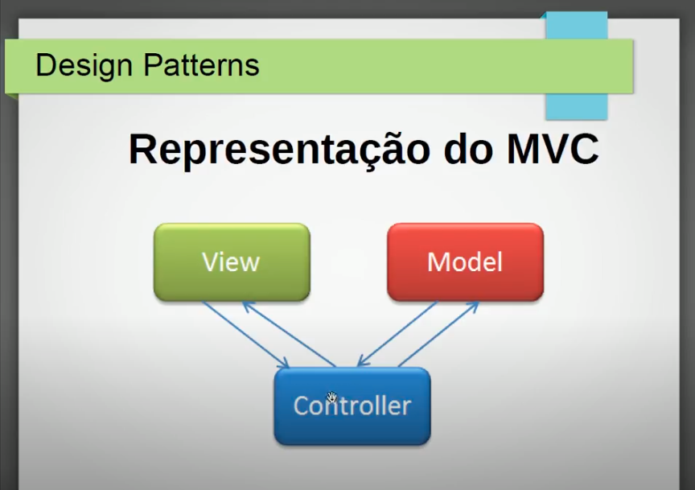
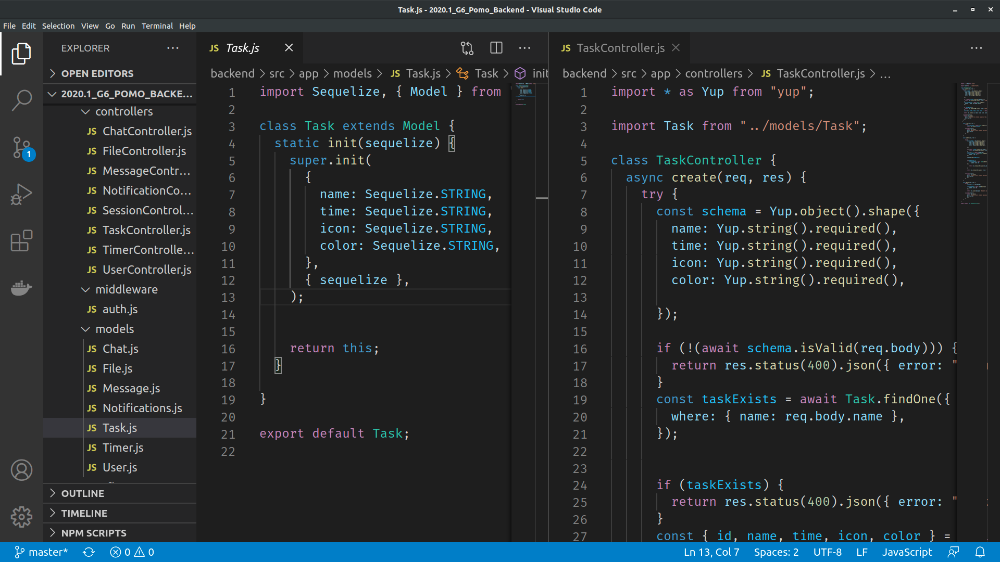
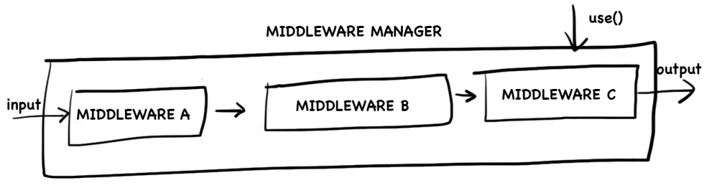
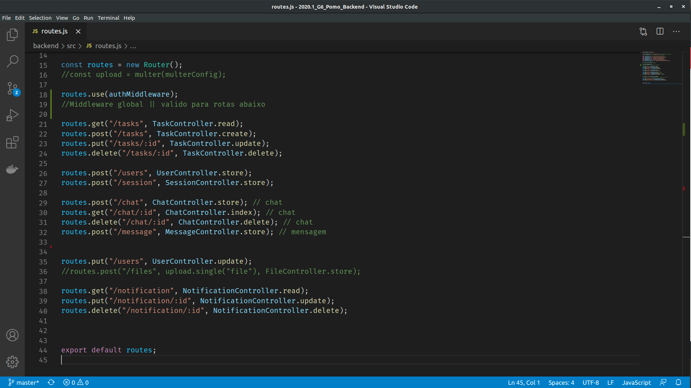
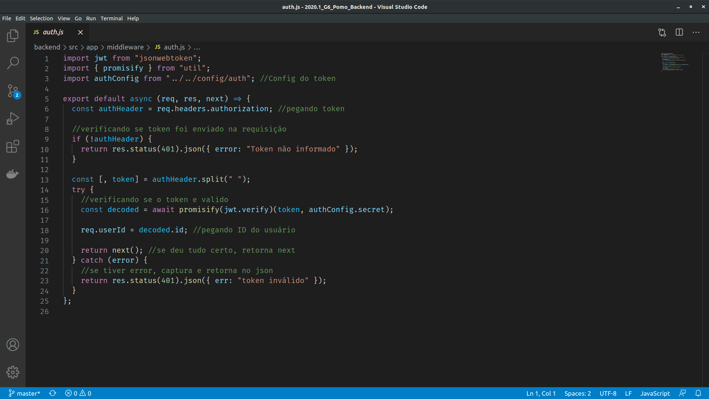

# **Padrões Emergentes**

## **Histórico de revisões**

|Data|Versão| Descrição| Autor|
| :-----: | :-----: | :------: | :------: |
| 26/10/2020 | 1.0 | Criação da página e adição do padrão MVC | [Arthur Rodrigues](https://github.com/arthurarp) |
| 26/10/2020 | 1.1 | Adição dos conceitos e aplicação do padrão Middleware | [Arthur Rodrigues](https://github.com/arthurarp) |

 

## **1. Padrões Emergentes**

### **1.1 MVC**

#### **1.1.1 Estrutura**

O MVC é utilizado em muitos projetos devido à arquitetura que possui, o que possibilita a divisão do projeto em camadas muito bem definidas. Cada uma delas, o Model, o Controller e a View, executa o que lhe é definido e nada mais do que isso.

#### **1.1.2 Benefícios**

A utilização do padrão MVC trás como benefício isolar as regras de negócios da lógica de apresentação, a interface com o usuário. Isto possibilita a existência de várias interfaces com o usuário que podem ser modificadas sem que haja a necessidade da alteração das regras de negócios, proporcionando assim muito mais flexibilidade e oportunidades de reuso das classes.

Uma das características de um padrão de projeto é poder aplicá-lo em sistemas distintos. O padrão MVC pode ser utilizado em vários tipos de projetos como, por exemplo, desktop, web e mobile.

#### **1.1.3 Aplicabilidade**

Este padrão poderá ser utilizado no Pomo mas com algumas adaptações. Como a nossa API só visa organizar os dados, só faz sentido, no nosso caso, utilizar as duas abordagens relacionadas à essa organização que são MODEL e CONTROLLER. Pois a VIEW será feita em um outro framework numa abordagem totalmente diferente. Este padrão só retorna dados do tipo JSON.

#### **1.1.4 Implementação no Pomo**

Como foi explicado acima, o padrão não será implementado por completo devido a camada VIEW não estar presente nessa parte do desenvolvimento do projeto. Abaixo segue um trecho do trabalho do grupo Unigrade que reflete bem o que foi implementado, também, no Pomo:

Devido ao padrão REST da API, a arquitetura implementada pelo grupo foi o padrão MC (Model, Controller) adaptado do padrão MVC (Model, View, Controller). O motivo desse padrão ser implementado é porque a View é determinada por nosso cliente que é resposavel por renderizar os dados processados pela API e como a API tem a responsabilidade apenas de processar, salvar e consultar dados na banco de dados, não havia lugar para essa camada, então foi persistido apenas a Model e a Controller.

Segue a foto da implementação do padrão MVC no projeto POMO:

### **1.2 Middlewares**

#### **1.2.1 Estrutura**
O padrão de Middleware implementado pelo express já é bem conhecido e tem sido usado por desenvolvedores em outras linguagens há muitos anos. Podemos dizer que se trata de uma implementação do padrão intercepting filter pattern do chain of responsibility.

A implementação representa um pipeline de processamento onde handlers, units e filters são funções. Essa funções são conectadas criando uma sequência de processamento assíncrona que permite pré-processamento, processamento e pós-processamento de qualquer tipo de dado.
Uma das principais vantagens desse pattern é a facilidade de adicionar plugins de maneira não intrusiva.

#### **1.2.2 Benefícios**

Alguns dos benefícios dos middlewares:

* Executar qualquer código.
* Fazer mudanças nos objetos de solicitação e resposta.
* Encerrar o ciclo de solicitação-resposta.
* Chamar o próximo middleware na pilha.

#### **1.2.3 Aplicabilidade**

No Pomo poderemos usar para fazer verificações sobre autenticação e autorização no acesso a determinada rota.

#### **1.2.4 Implementação no Pomo**

Podemos perceber que a partir da linha 18 do código, todas as rotas, que estão abaixo, irão passar por um middleware de autenticação antes de retornar o resultado esperado.

Já na imagem abaixo temos o nosso middleware manager, que é a função que fica responsável por executar cada middleware implementado, que no nosso caso até então é so o relacionado a autenticação.

## **2. Referências**

1. Higor. Introdução ao padrão MVC. Devmedia, 2013. Disponível em: <https://www.devmedia.com.br/introducao-ao-padrao-mvc/29308>. Acesso em: 26/10/2020.

2. ALBERTO, Luiz. Design Patterns #08: MVC parte 1. 08 de Junho de 2018. Disponível em: <https://www.youtube.com/watch?v=wKwVlB_Sxtc>. Acesso em: 26/10/2020.

3. Grupo Unigrade. Padrões Emergentes: API. Matéria de Arquitetura e Desenho de Software, 2019. Disponível em: <https://ads-unigrade-2019-1.github.io/Wiki/dinamica05B/api/>. Acesso em: 26/10/2020.

4. NETO, Waldemar. Entendendo o Middleware pattern em Node.js. 11 de Setembro de 2017. Disponível em: <https://walde.co/2017/09/11/entendendo-o-middleware-pattern-em-node-js/>. Acesso em: 26/10/2020.

5. Express. Escrevendo middlewares pra uso em aplicativos do Express. Disponível em: <https://expressjs.com/pt-br/guide/writing-middleware.html>. Acesso em: 26/10/2020.